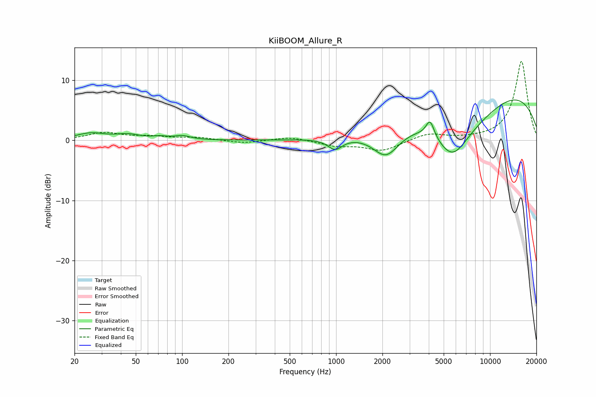

# KiiBOOM_Allure_R
See [usage instructions](https://github.com/jaakkopasanen/AutoEq#usage) for more options and info.

### Parametric EQs
Apply preamp of -6.8 dB when using parametric equalizer.

|   # | Type    |   Fc (Hz) |    Q |   Gain (dB) |
|-----|---------|-----------|------|-------------|
|   1 | Peaking |        26 | 1.52 |         1.1 |
|   2 | Peaking |        45 | 1.85 |         0.8 |
|   3 | Peaking |        72 | 2.86 |         0.4 |
|   4 | Peaking |       100 | 2.82 |         0.6 |
|   5 | Peaking |       985 | 3.05 |        -1.8 |
|   6 | Peaking |      2113 | 1.63 |        -4.5 |
|   7 | Peaking |      4080 | 5.25 |         2.8 |
|   8 | Peaking |      5674 | 1.28 |        -6.2 |
|   9 | Peaking |      7681 | 0.54 |        -5.4 |
|  10 | Peaking |      9891 | 0.25 |        10.5 |

### Fixed Band EQs
When using fixed band (also called graphic) equalizer, apply preamp of **-13.2 dB** (if available) and set gains manually with these parameters.

|   # | Type    |   Fc (Hz) |    Q |   Gain (dB) |
|-----|---------|-----------|------|-------------|
|   1 | Peaking |        31 | 1.41 |         1.2 |
|   2 | Peaking |        62 | 1.41 |         0.5 |
|   3 | Peaking |       125 | 1.41 |         0.5 |
|   4 | Peaking |       250 | 1.41 |        -0.5 |
|   5 | Peaking |       500 | 1.41 |         0.6 |
|   6 | Peaking |      1000 | 1.41 |        -0.9 |
|   7 | Peaking |      2000 | 1.41 |        -1.7 |
|   8 | Peaking |      4000 | 1.41 |         1.1 |
|   9 | Peaking |      8000 | 1.41 |         0.1 |
|  10 | Peaking |     16000 | 1.41 |        13.2 |

### Graphs

