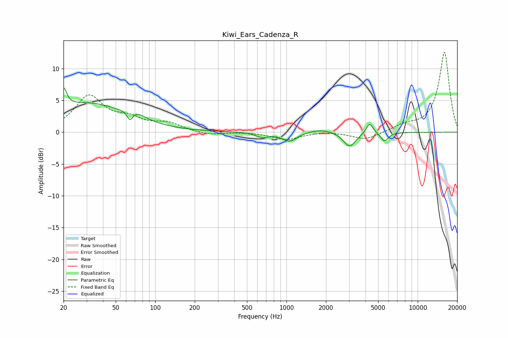

# Kiwi_Ears_Cadenza_R
See [usage instructions](https://github.com/jaakkopasanen/AutoEq#usage) for more options and info.

### Parametric EQs
Apply preamp of -7.1 dB when using parametric equalizer.

|   # | Type    |   Fc (Hz) |    Q |   Gain (dB) |
|-----|---------|-----------|------|-------------|
|   1 | Peaking |        20 | 5.92 |         3.2 |
|   2 | Peaking |        30 | 0.5  |         4.5 |
|   3 | Peaking |        64 | 5.99 |        -1.7 |
|   4 | Peaking |        69 | 2    |         1.1 |
|   5 | Peaking |       657 | 2.93 |        -0.7 |
|   6 | Peaking |      1055 | 2.52 |        -1.4 |
|   7 | Peaking |      1843 | 1.48 |         0.6 |
|   8 | Peaking |      3027 | 3    |        -2.3 |
|   9 | Peaking |      4307 | 5.53 |         1.7 |
|  10 | Peaking |      5592 | 4.84 |        -1.4 |

### Fixed Band EQs
When using fixed band (also called graphic) equalizer, apply preamp of **-12.7 dB** (if available) and set gains manually with these parameters.

|   # | Type    |   Fc (Hz) |    Q |   Gain (dB) |
|-----|---------|-----------|------|-------------|
|   1 | Peaking |        31 | 1.41 |         5.5 |
|   2 | Peaking |        62 | 1.41 |         1.7 |
|   3 | Peaking |       125 | 1.41 |         1.3 |
|   4 | Peaking |       250 | 1.41 |        -0.5 |
|   5 | Peaking |       500 | 1.41 |         0   |
|   6 | Peaking |      1000 | 1.41 |        -1.1 |
|   7 | Peaking |      2000 | 1.41 |         0.2 |
|   8 | Peaking |      4000 | 1.41 |        -1.2 |
|   9 | Peaking |      8000 | 1.41 |         0.9 |
|  10 | Peaking |     16000 | 1.41 |        12.6 |

### Graphs

