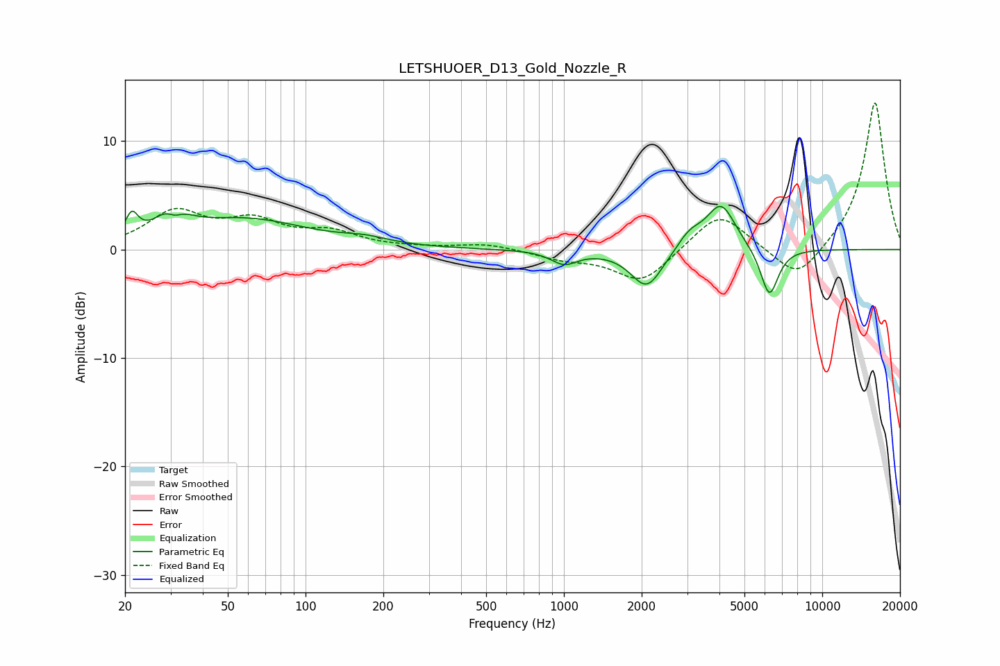

# LETSHUOER_D13_Gold_Nozzle_R
See [usage instructions](https://github.com/jaakkopasanen/AutoEq#usage) for more options and info.

### Parametric EQs
Apply preamp of -4.1 dB when using parametric equalizer.

|   # | Type    |   Fc (Hz) |    Q |   Gain (dB) |
|-----|---------|-----------|------|-------------|
|   1 | Peaking |        21 | 5.99 |         2.1 |
|   2 | Peaking |        31 | 2.65 |         3.2 |
|   3 | Peaking |        31 | 4.23 |        -1.8 |
|   4 | Peaking |        58 | 0.58 |         2.7 |
|   5 | Peaking |       171 | 1.58 |         0.5 |
|   6 | Peaking |      1002 | 2.74 |        -1.2 |
|   7 | Peaking |      2095 | 2.28 |        -3.6 |
|   8 | Peaking |      3065 | 2.88 |         1.4 |
|   9 | Peaking |      4058 | 2.46 |         4.2 |
|  10 | Peaking |      6242 | 3.97 |        -4.6 |

### Fixed Band EQs
When using fixed band (also called graphic) equalizer, apply preamp of **-13.6 dB** (if available) and set gains manually with these parameters.

|   # | Type    |   Fc (Hz) |    Q |   Gain (dB) |
|-----|---------|-----------|------|-------------|
|   1 | Peaking |        31 | 1.41 |         3.3 |
|   2 | Peaking |        62 | 1.41 |         2.3 |
|   3 | Peaking |       125 | 1.41 |         1.4 |
|   4 | Peaking |       250 | 1.41 |         0.1 |
|   5 | Peaking |       500 | 1.41 |         0.5 |
|   6 | Peaking |      1000 | 1.41 |        -0.8 |
|   7 | Peaking |      2000 | 1.41 |        -3.1 |
|   8 | Peaking |      4000 | 1.41 |         3.6 |
|   9 | Peaking |      8000 | 1.41 |        -3.1 |
|  10 | Peaking |     16000 | 1.41 |        13.7 |

### Graphs

