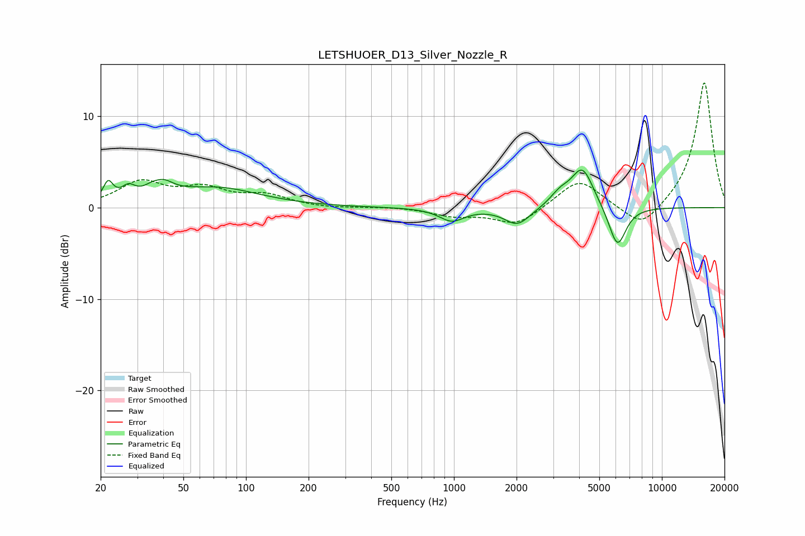

# LETSHUOER_D13_Silver_Nozzle_R
See [usage instructions](https://github.com/jaakkopasanen/AutoEq#usage) for more options and info.

### Parametric EQs
Apply preamp of -4.2 dB when using parametric equalizer.

|   # | Type    |   Fc (Hz) |    Q |   Gain (dB) |
|-----|---------|-----------|------|-------------|
|   1 | Peaking |        22 | 5.98 |         2.1 |
|   2 | Peaking |        27 | 4.28 |         1.3 |
|   3 | Peaking |        38 | 4.26 |        -1.2 |
|   4 | Peaking |        38 | 2.9  |         2.9 |
|   5 | Peaking |        72 | 0.69 |         2.1 |
|   6 | Peaking |       976 | 2.36 |        -1.4 |
|   7 | Peaking |      2020 | 2.27 |        -2   |
|   8 | Peaking |      3234 | 2.95 |         1.2 |
|   9 | Peaking |      4148 | 2.58 |         4.4 |
|  10 | Peaking |      6109 | 3.3  |        -4.5 |

### Fixed Band EQs
When using fixed band (also called graphic) equalizer, apply preamp of **-13.7 dB** (if available) and set gains manually with these parameters.

|   # | Type    |   Fc (Hz) |    Q |   Gain (dB) |
|-----|---------|-----------|------|-------------|
|   1 | Peaking |        31 | 1.41 |         2.7 |
|   2 | Peaking |        62 | 1.41 |         1.8 |
|   3 | Peaking |       125 | 1.41 |         1.2 |
|   4 | Peaking |       250 | 1.41 |        -0.1 |
|   5 | Peaking |       500 | 1.41 |         0.1 |
|   6 | Peaking |      1000 | 1.41 |        -0.8 |
|   7 | Peaking |      2000 | 1.41 |        -1.9 |
|   8 | Peaking |      4000 | 1.41 |         3.2 |
|   9 | Peaking |      8000 | 1.41 |        -2.6 |
|  10 | Peaking |     16000 | 1.41 |        13.8 |

### Graphs

