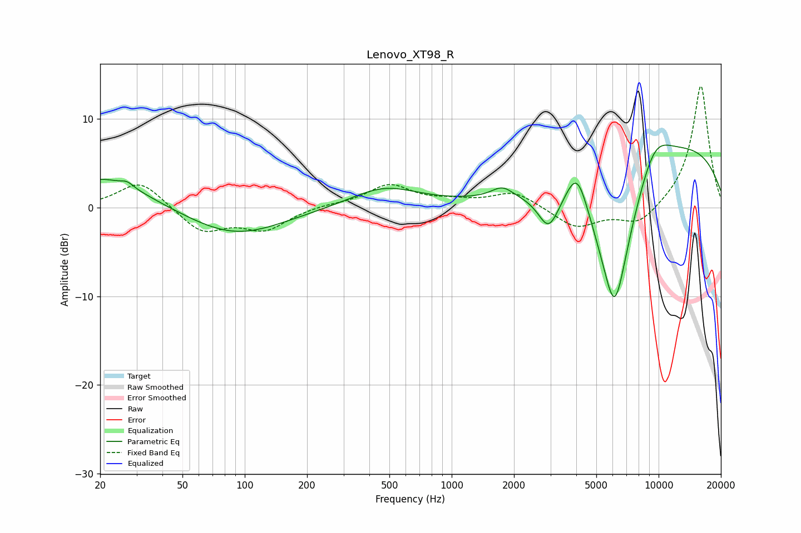

# Lenovo_XT98_R
See [usage instructions](https://github.com/jaakkopasanen/AutoEq#usage) for more options and info.

### Parametric EQs
Apply preamp of -7.2 dB when using parametric equalizer.

|   # | Type    |   Fc (Hz) |    Q |   Gain (dB) |
|-----|---------|-----------|------|-------------|
|   1 | Peaking |        21 | 0.69 |         3.6 |
|   2 | Peaking |        27 | 5.12 |         0.5 |
|   3 | Peaking |        90 | 0.61 |        -3.2 |
|   4 | Peaking |       472 | 0.85 |         2.3 |
|   5 | Peaking |      1756 | 2.76 |         1.2 |
|   6 | Peaking |      2941 | 2.8  |        -3.8 |
|   7 | Peaking |      4038 | 2.5  |         5.3 |
|   8 | Peaking |      6128 | 1.31 |       -19.8 |
|   9 | Peaking |      9468 | 1.4  |         4.4 |
|  10 | Peaking |      9857 | 0.24 |         8.6 |

### Fixed Band EQs
When using fixed band (also called graphic) equalizer, apply preamp of **-13.8 dB** (if available) and set gains manually with these parameters.

|   # | Type    |   Fc (Hz) |    Q |   Gain (dB) |
|-----|---------|-----------|------|-------------|
|   1 | Peaking |        31 | 1.41 |         3.1 |
|   2 | Peaking |        62 | 1.41 |        -2.8 |
|   3 | Peaking |       125 | 1.41 |        -2.4 |
|   4 | Peaking |       250 | 1.41 |         0.3 |
|   5 | Peaking |       500 | 1.41 |         2.5 |
|   6 | Peaking |      1000 | 1.41 |         0.6 |
|   7 | Peaking |      2000 | 1.41 |         1.8 |
|   8 | Peaking |      4000 | 1.41 |        -2.3 |
|   9 | Peaking |      8000 | 1.41 |        -2.1 |
|  10 | Peaking |     16000 | 1.41 |        13.9 |

### Graphs

