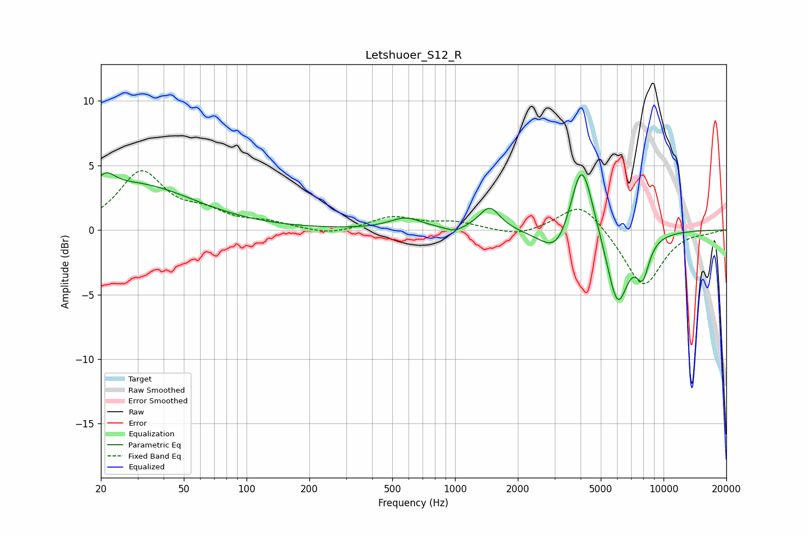

# Letshuoer_S12_R
See [usage instructions](https://github.com/jaakkopasanen/AutoEq#usage) for more options and info.

### Parametric EQs
Apply preamp of -4.5 dB when using parametric equalizer.

|   # | Type    |   Fc (Hz) |    Q |   Gain (dB) |
|-----|---------|-----------|------|-------------|
|   1 | Peaking |        20 | 4.87 |         0.1 |
|   2 | Peaking |        21 | 3.28 |         1.2 |
|   3 | Peaking |        29 | 0.5  |         3.5 |
|   4 | Peaking |       578 | 1.85 |         0.9 |
|   5 | Peaking |       993 | 3.34 |        -0.4 |
|   6 | Peaking |      1466 | 2.83 |         1.8 |
|   7 | Peaking |      3116 | 1.77 |        -2.5 |
|   8 | Peaking |      4041 | 2.53 |         6.6 |
|   9 | Peaking |      6011 | 2.6  |        -5.9 |
|  10 | Peaking |      7944 | 4.11 |        -2.7 |

### Fixed Band EQs
When using fixed band (also called graphic) equalizer, apply preamp of **-4.7 dB** (if available) and set gains manually with these parameters.

|   # | Type    |   Fc (Hz) |    Q |   Gain (dB) |
|-----|---------|-----------|------|-------------|
|   1 | Peaking |        31 | 1.41 |         4.4 |
|   2 | Peaking |        62 | 1.41 |         1.1 |
|   3 | Peaking |       125 | 1.41 |         0.5 |
|   4 | Peaking |       250 | 1.41 |        -0.4 |
|   5 | Peaking |       500 | 1.41 |         1   |
|   6 | Peaking |      1000 | 1.41 |         0.6 |
|   7 | Peaking |      2000 | 1.41 |        -0.5 |
|   8 | Peaking |      4000 | 1.41 |         2.3 |
|   9 | Peaking |      8000 | 1.41 |        -4.5 |
|  10 | Peaking |     16000 | 1.41 |        -0.1 |

### Graphs

