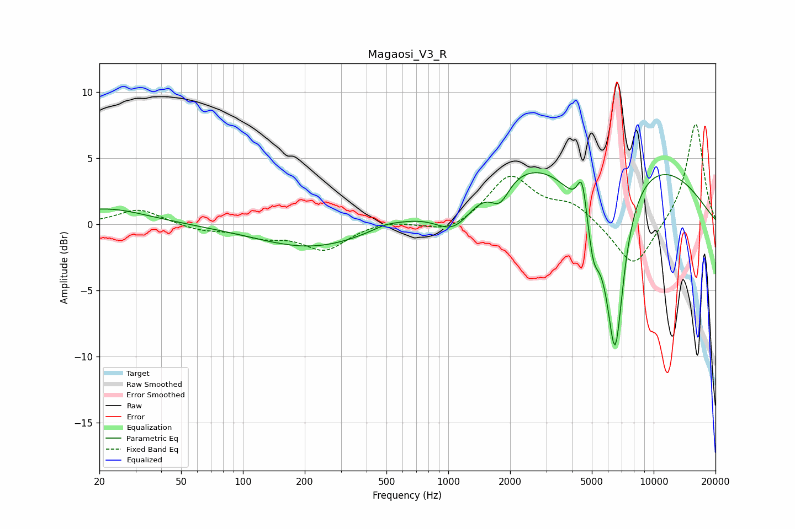

# Magaosi_V3_R
See [usage instructions](https://github.com/jaakkopasanen/AutoEq#usage) for more options and info.

### Parametric EQs
Apply preamp of -4.0 dB when using parametric equalizer.

|   # | Type    |   Fc (Hz) |    Q |   Gain (dB) |
|-----|---------|-----------|------|-------------|
|   1 | Peaking |        21 | 0.71 |         1.2 |
|   2 | Peaking |       221 | 0.52 |        -1.9 |
|   3 | Peaking |       497 | 2.12 |         0.3 |
|   4 | Peaking |      1072 | 1.44 |        -2.7 |
|   5 | Peaking |      1786 | 3.04 |        -1.8 |
|   6 | Peaking |      4485 | 5.99 |         3.2 |
|   7 | Peaking |      4926 | 0.23 |         6.8 |
|   8 | Peaking |      5090 | 5.36 |        -2.3 |
|   9 | Peaking |      5169 | 1.05 |        -4.7 |
|  10 | Peaking |      6496 | 3.17 |       -11.9 |

### Fixed Band EQs
When using fixed band (also called graphic) equalizer, apply preamp of **-7.7 dB** (if available) and set gains manually with these parameters.

|   # | Type    |   Fc (Hz) |    Q |   Gain (dB) |
|-----|---------|-----------|------|-------------|
|   1 | Peaking |        31 | 1.41 |         1.2 |
|   2 | Peaking |        62 | 1.41 |        -0.4 |
|   3 | Peaking |       125 | 1.41 |        -0.8 |
|   4 | Peaking |       250 | 1.41 |        -1.9 |
|   5 | Peaking |       500 | 1.41 |         0.3 |
|   6 | Peaking |      1000 | 1.41 |        -0.8 |
|   7 | Peaking |      2000 | 1.41 |         3.6 |
|   8 | Peaking |      4000 | 1.41 |         1.4 |
|   9 | Peaking |      8000 | 1.41 |        -3.5 |
|  10 | Peaking |     16000 | 1.41 |         7.8 |

### Graphs

