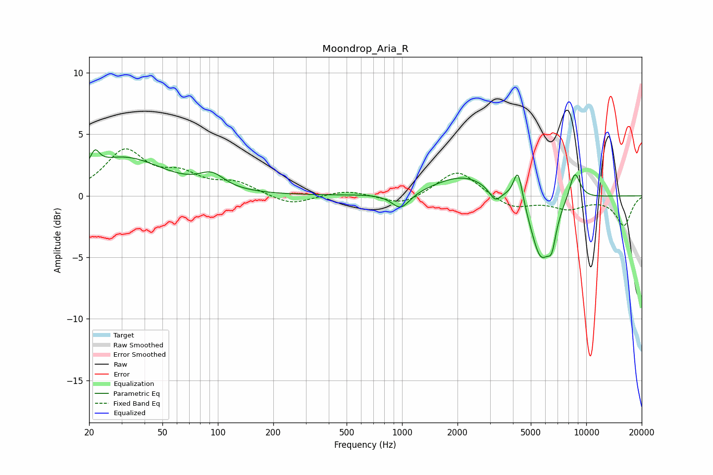

# Moondrop_Aria_R
See [usage instructions](https://github.com/jaakkopasanen/AutoEq#usage) for more options and info.

### Parametric EQs
Apply preamp of -3.8 dB when using parametric equalizer.

|   # | Type    |   Fc (Hz) |    Q |   Gain (dB) |
|-----|---------|-----------|------|-------------|
|   1 | Peaking |        22 | 5.93 |         1.2 |
|   2 | Peaking |        31 | 0.65 |         3   |
|   3 | Peaking |        93 | 2.09 |         1.2 |
|   4 | Peaking |       984 | 2.84 |        -1.4 |
|   5 | Peaking |      2157 | 0.9  |         1.7 |
|   6 | Peaking |      3198 | 4.49 |        -1   |
|   7 | Peaking |      4262 | 5.66 |         2.8 |
|   8 | Peaking |      5666 | 2.41 |        -5.1 |
|   9 | Peaking |      6504 | 5.99 |        -2   |
|  10 | Peaking |      8660 | 4.24 |         2.4 |

### Fixed Band EQs
When using fixed band (also called graphic) equalizer, apply preamp of **-3.9 dB** (if available) and set gains manually with these parameters.

|   # | Type    |   Fc (Hz) |    Q |   Gain (dB) |
|-----|---------|-----------|------|-------------|
|   1 | Peaking |        31 | 1.41 |         3.5 |
|   2 | Peaking |        62 | 1.41 |         1.4 |
|   3 | Peaking |       125 | 1.41 |         1   |
|   4 | Peaking |       250 | 1.41 |        -0.8 |
|   5 | Peaking |       500 | 1.41 |         0.5 |
|   6 | Peaking |      1000 | 1.41 |        -0.8 |
|   7 | Peaking |      2000 | 1.41 |         2.2 |
|   8 | Peaking |      4000 | 1.41 |        -1   |
|   9 | Peaking |      8000 | 1.41 |        -0.9 |
|  10 | Peaking |     16000 | 1.41 |        -2.4 |

### Graphs

