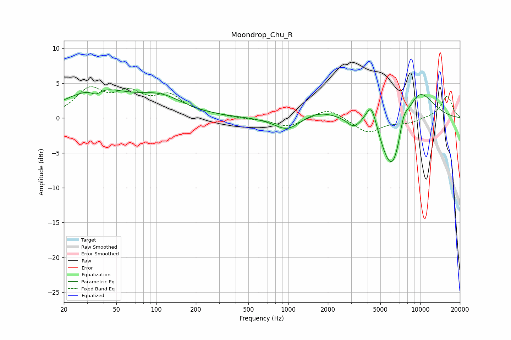

# Moondrop_Chu_R
See [usage instructions](https://github.com/jaakkopasanen/AutoEq#usage) for more options and info.

### Parametric EQs
Apply preamp of -4.1 dB when using parametric equalizer.

|   # | Type    |   Fc (Hz) |    Q |   Gain (dB) |
|-----|---------|-----------|------|-------------|
|   1 | Peaking |        35 | 3.91 |        -0.8 |
|   2 | Peaking |        35 | 0.61 |         3.8 |
|   3 | Peaking |       110 | 0.8  |         2.4 |
|   4 | Peaking |       992 | 1.41 |        -2.1 |
|   5 | Peaking |      1705 | 0.89 |         1.4 |
|   6 | Peaking |      3118 | 3.32 |        -1   |
|   7 | Peaking |      4272 | 3.07 |         4.3 |
|   8 | Peaking |      6185 | 1.37 |       -10.1 |
|   9 | Peaking |      7475 | 3.7  |         2.8 |
|  10 | Peaking |      9492 | 1.02 |         5.7 |

### Fixed Band EQs
When using fixed band (also called graphic) equalizer, apply preamp of **-4.6 dB** (if available) and set gains manually with these parameters.

|   # | Type    |   Fc (Hz) |    Q |   Gain (dB) |
|-----|---------|-----------|------|-------------|
|   1 | Peaking |        31 | 1.41 |         3.8 |
|   2 | Peaking |        62 | 1.41 |         3   |
|   3 | Peaking |       125 | 1.41 |         2.8 |
|   4 | Peaking |       250 | 1.41 |         0.3 |
|   5 | Peaking |       500 | 1.41 |        -0.1 |
|   6 | Peaking |      1000 | 1.41 |        -1.3 |
|   7 | Peaking |      2000 | 1.41 |         1.5 |
|   8 | Peaking |      4000 | 1.41 |        -2.1 |
|   9 | Peaking |      8000 | 1.41 |        -0.7 |
|  10 | Peaking |     16000 | 1.41 |         3.2 |

### Graphs

