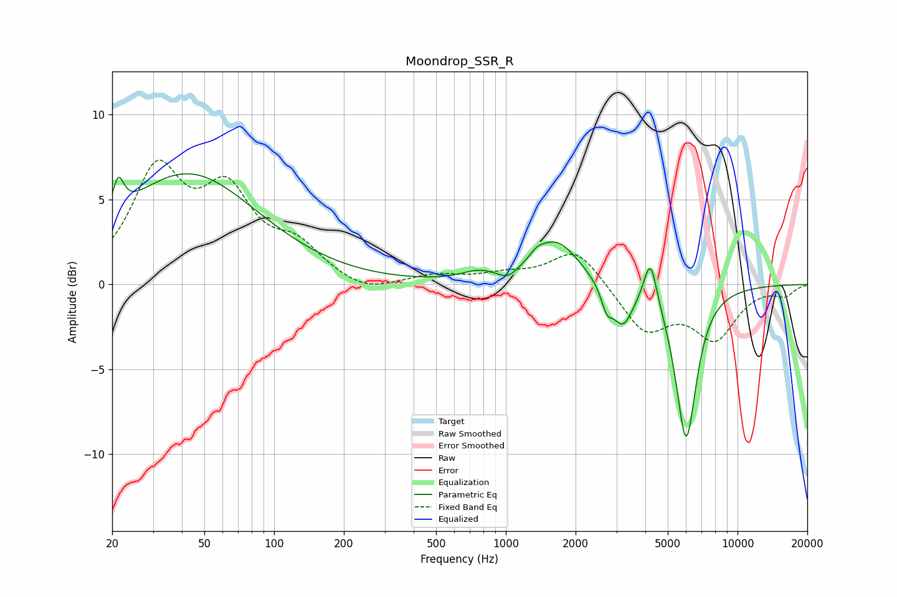

# Moondrop_SSR_R
See [usage instructions](https://github.com/jaakkopasanen/AutoEq#usage) for more options and info.

### Parametric EQs
Apply preamp of -6.6 dB when using parametric equalizer.

|   # | Type    |   Fc (Hz) |    Q |   Gain (dB) |
|-----|---------|-----------|------|-------------|
|   1 | Peaking |        21 | 6    |         2   |
|   2 | Peaking |        42 | 0.47 |         6.5 |
|   3 | Peaking |       763 | 1.95 |         0.5 |
|   4 | Peaking |      1022 | 3.41 |        -0.5 |
|   5 | Peaking |      1363 | 4.35 |         0.4 |
|   6 | Peaking |      1652 | 1.45 |         2.6 |
|   7 | Peaking |      2725 | 5.99 |        -1.2 |
|   8 | Peaking |      3193 | 3.14 |        -2.3 |
|   9 | Peaking |      4206 | 4.99 |         2.7 |
|  10 | Peaking |      5998 | 3.04 |        -9.1 |

### Fixed Band EQs
When using fixed band (also called graphic) equalizer, apply preamp of **-7.4 dB** (if available) and set gains manually with these parameters.

|   # | Type    |   Fc (Hz) |    Q |   Gain (dB) |
|-----|---------|-----------|------|-------------|
|   1 | Peaking |        31 | 1.41 |         6.3 |
|   2 | Peaking |        62 | 1.41 |         4.8 |
|   3 | Peaking |       125 | 1.41 |         1.9 |
|   4 | Peaking |       250 | 1.41 |        -0.6 |
|   5 | Peaking |       500 | 1.41 |         0.5 |
|   6 | Peaking |      1000 | 1.41 |         0.5 |
|   7 | Peaking |      2000 | 1.41 |         2.2 |
|   8 | Peaking |      4000 | 1.41 |        -2.7 |
|   9 | Peaking |      8000 | 1.41 |        -3   |
|  10 | Peaking |     16000 | 1.41 |        -0.6 |

### Graphs

