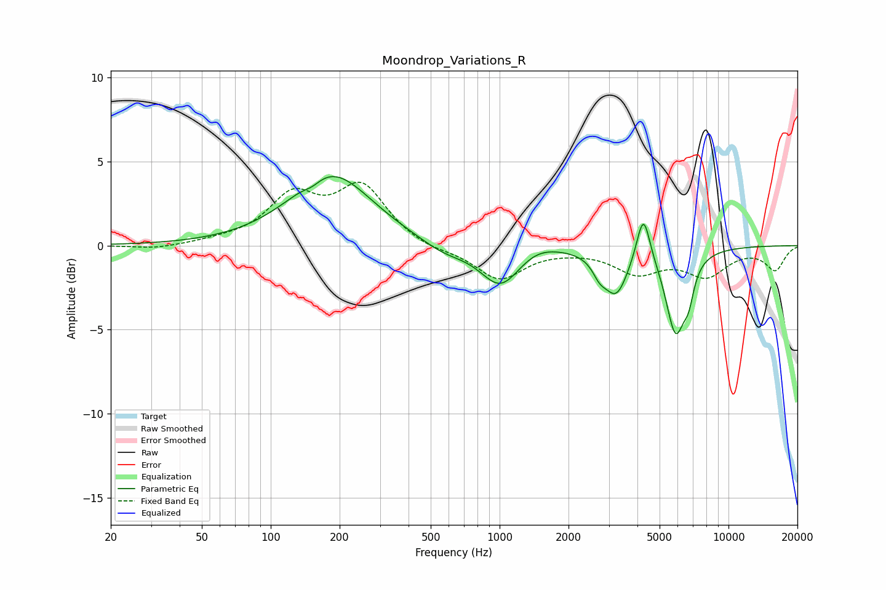

# Moondrop_Variations_R
See [usage instructions](https://github.com/jaakkopasanen/AutoEq#usage) for more options and info.

### Parametric EQs
Apply preamp of -4.2 dB when using parametric equalizer.

|   # | Type    |   Fc (Hz) |    Q |   Gain (dB) |
|-----|---------|-----------|------|-------------|
|   1 | Peaking |       152 | 3.85 |        -0.3 |
|   2 | Peaking |       184 | 0.81 |         4.3 |
|   3 | Peaking |       569 | 1.37 |        -0.7 |
|   4 | Peaking |      1009 | 1.62 |        -2.5 |
|   5 | Peaking |      1449 | 1.56 |         0.5 |
|   6 | Peaking |      2732 | 4.73 |        -0.8 |
|   7 | Peaking |      3230 | 2.7  |        -2.6 |
|   8 | Peaking |      4247 | 4.84 |         2.9 |
|   9 | Peaking |      5873 | 3.21 |        -4.9 |
|  10 | Peaking |      6702 | 6    |        -1.4 |

### Fixed Band EQs
When using fixed band (also called graphic) equalizer, apply preamp of **-3.9 dB** (if available) and set gains manually with these parameters.

|   # | Type    |   Fc (Hz) |    Q |   Gain (dB) |
|-----|---------|-----------|------|-------------|
|   1 | Peaking |        31 | 1.41 |        -0.2 |
|   2 | Peaking |        62 | 1.41 |         0.2 |
|   3 | Peaking |       125 | 1.41 |         2.8 |
|   4 | Peaking |       250 | 1.41 |         3.4 |
|   5 | Peaking |       500 | 1.41 |        -0.3 |
|   6 | Peaking |      1000 | 1.41 |        -2   |
|   7 | Peaking |      2000 | 1.41 |        -0.1 |
|   8 | Peaking |      4000 | 1.41 |        -1.5 |
|   9 | Peaking |      8000 | 1.41 |        -1.6 |
|  10 | Peaking |     16000 | 1.41 |        -1.4 |

### Graphs

