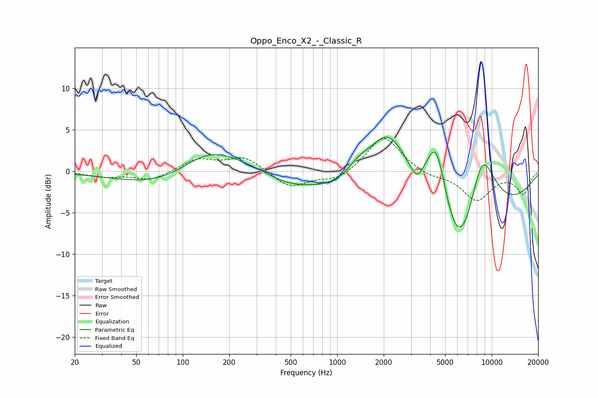

# Oppo_Enco_X2_-_Classic_R
See [usage instructions](https://github.com/jaakkopasanen/AutoEq#usage) for more options and info.

### Parametric EQs
Apply preamp of -4.2 dB when using parametric equalizer.

|   # | Type    |   Fc (Hz) |    Q |   Gain (dB) |
|-----|---------|-----------|------|-------------|
|   1 | Peaking |        98 | 0.47 |        -3.9 |
|   2 | Peaking |       144 | 0.61 |         5.5 |
|   3 | Peaking |       470 | 1.06 |        -1   |
|   4 | Peaking |      1160 | 0.56 |        -2.9 |
|   5 | Peaking |      1361 | 1.77 |         1.6 |
|   6 | Peaking |      2148 | 0.87 |        10.5 |
|   7 | Peaking |      3280 | 3.67 |        -1.6 |
|   8 | Peaking |      4385 | 1.7  |        11.4 |
|   9 | Peaking |      6143 | 0.55 |       -20   |
|  10 | Peaking |      8596 | 1.09 |        13.6 |

### Fixed Band EQs
When using fixed band (also called graphic) equalizer, apply preamp of **-4.0 dB** (if available) and set gains manually with these parameters.

|   # | Type    |   Fc (Hz) |    Q |   Gain (dB) |
|-----|---------|-----------|------|-------------|
|   1 | Peaking |        31 | 1.41 |        -0.6 |
|   2 | Peaking |        62 | 1.41 |        -1.1 |
|   3 | Peaking |       125 | 1.41 |         1.5 |
|   4 | Peaking |       250 | 1.41 |         1.7 |
|   5 | Peaking |       500 | 1.41 |        -2   |
|   6 | Peaking |      1000 | 1.41 |        -1.2 |
|   7 | Peaking |      2000 | 1.41 |         4.4 |
|   8 | Peaking |      4000 | 1.41 |        -0.6 |
|   9 | Peaking |      8000 | 1.41 |        -3.4 |
|  10 | Peaking |     16000 | 1.41 |        -2.6 |

### Graphs

