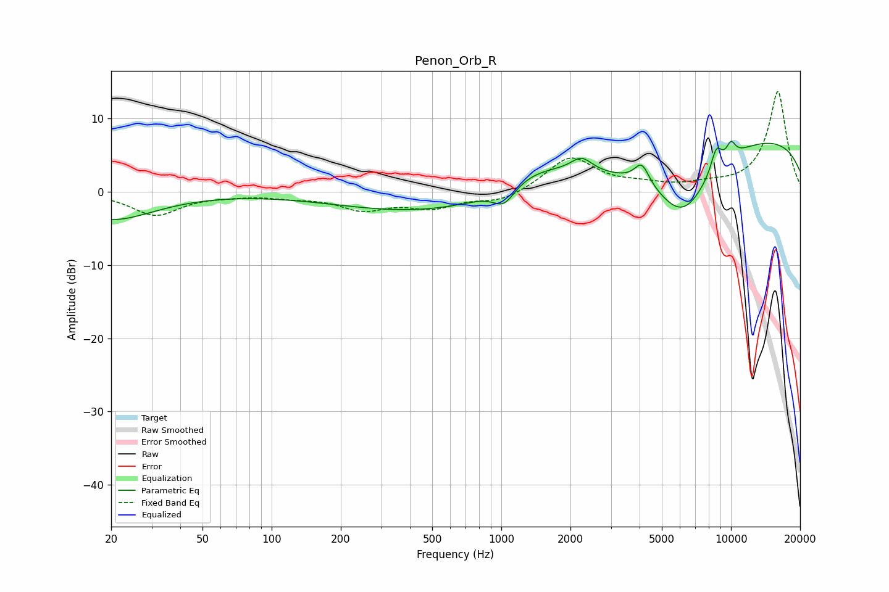

# Penon_Orb_R
See [usage instructions](https://github.com/jaakkopasanen/AutoEq#usage) for more options and info.

### Parametric EQs
Apply preamp of -7.0 dB when using parametric equalizer.

|   # | Type    |   Fc (Hz) |    Q |   Gain (dB) |
|-----|---------|-----------|------|-------------|
|   1 | Peaking |        20 | 0.74 |        -3.8 |
|   2 | Peaking |       878 | 0.22 |        -3.7 |
|   3 | Peaking |      1029 | 2.96 |        -2.5 |
|   4 | Peaking |      1404 | 0.78 |         4.1 |
|   5 | Peaking |      2235 | 3    |         2   |
|   6 | Peaking |      4092 | 4.37 |         2.8 |
|   7 | Peaking |      6157 | 1.03 |        -9.3 |
|   8 | Peaking |      8635 | 5.35 |         3.1 |
|   9 | Peaking |      9999 | 0.18 |         8   |
|  10 | Peaking |     10000 | 6    |         2   |

### Fixed Band EQs
When using fixed band (also called graphic) equalizer, apply preamp of **-13.7 dB** (if available) and set gains manually with these parameters.

|   # | Type    |   Fc (Hz) |    Q |   Gain (dB) |
|-----|---------|-----------|------|-------------|
|   1 | Peaking |        31 | 1.41 |        -3.1 |
|   2 | Peaking |        62 | 1.41 |        -0.3 |
|   3 | Peaking |       125 | 1.41 |        -0.6 |
|   4 | Peaking |       250 | 1.41 |        -2.2 |
|   5 | Peaking |       500 | 1.41 |        -2   |
|   6 | Peaking |      1000 | 1.41 |        -1.4 |
|   7 | Peaking |      2000 | 1.41 |         4.7 |
|   8 | Peaking |      4000 | 1.41 |         0.7 |
|   9 | Peaking |      8000 | 1.41 |         0.7 |
|  10 | Peaking |     16000 | 1.41 |        13.7 |

### Graphs

