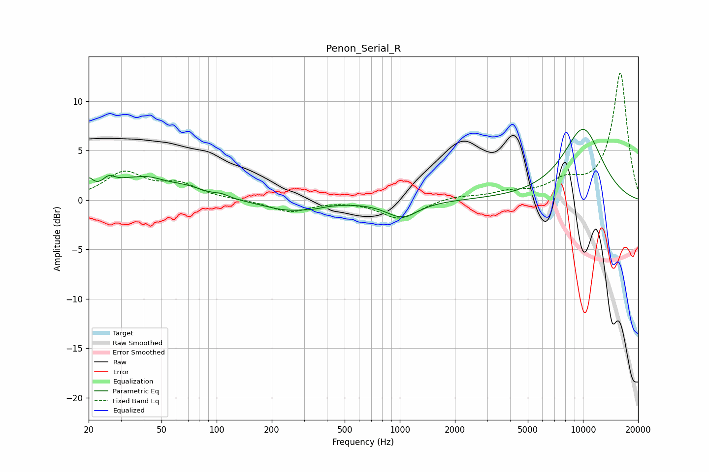

# Penon_Serial_R
See [usage instructions](https://github.com/jaakkopasanen/AutoEq#usage) for more options and info.

### Parametric EQs
Apply preamp of -7.3 dB when using parametric equalizer.

|   # | Type    |   Fc (Hz) |    Q |   Gain (dB) |
|-----|---------|-----------|------|-------------|
|   1 | Peaking |        20 | 5.82 |         1.3 |
|   2 | Peaking |        26 | 4.27 |         0.9 |
|   3 | Peaking |        37 | 2.2  |        -0.4 |
|   4 | Peaking |        38 | 1.07 |         2.5 |
|   5 | Peaking |        69 | 1.46 |         0.7 |
|   6 | Peaking |       106 | 3.61 |         0.3 |
|   7 | Peaking |       249 | 0.99 |        -1   |
|   8 | Peaking |       340 | 3.17 |        -0.1 |
|   9 | Peaking |      1027 | 1.61 |        -1.7 |
|  10 | Peaking |     10000 | 1.07 |         7.2 |

### Fixed Band EQs
When using fixed band (also called graphic) equalizer, apply preamp of **-13.0 dB** (if available) and set gains manually with these parameters.

|   # | Type    |   Fc (Hz) |    Q |   Gain (dB) |
|-----|---------|-----------|------|-------------|
|   1 | Peaking |        31 | 1.41 |         2.7 |
|   2 | Peaking |        62 | 1.41 |         1.4 |
|   3 | Peaking |       125 | 1.41 |         0   |
|   4 | Peaking |       250 | 1.41 |        -1.2 |
|   5 | Peaking |       500 | 1.41 |         0   |
|   6 | Peaking |      1000 | 1.41 |        -1.9 |
|   7 | Peaking |      2000 | 1.41 |         0.4 |
|   8 | Peaking |      4000 | 1.41 |         0.7 |
|   9 | Peaking |      8000 | 1.41 |         1.6 |
|  10 | Peaking |     16000 | 1.41 |        12.9 |

### Graphs

