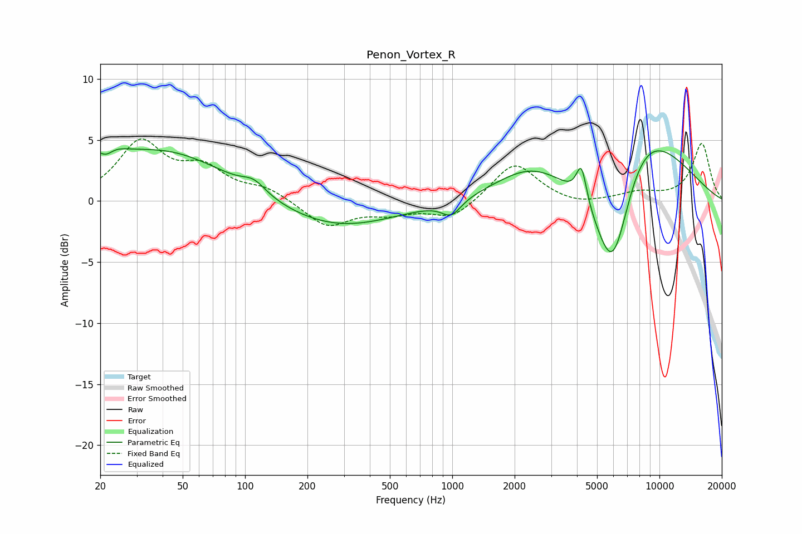

# Penon_Vortex_R
See [usage instructions](https://github.com/jaakkopasanen/AutoEq#usage) for more options and info.

### Parametric EQs
Apply preamp of -4.4 dB when using parametric equalizer.

|   # | Type    |   Fc (Hz) |    Q |   Gain (dB) |
|-----|---------|-----------|------|-------------|
|   1 | Peaking |        21 | 2.19 |         4   |
|   2 | Peaking |        21 | 3.17 |        -2.9 |
|   3 | Peaking |        41 | 0.46 |         4.1 |
|   4 | Peaking |       110 | 2.49 |         0.9 |
|   5 | Peaking |       274 | 0.49 |        -2.3 |
|   6 | Peaking |       990 | 3.03 |        -1.3 |
|   7 | Peaking |      2379 | 0.83 |         2.3 |
|   8 | Peaking |      4202 | 5.67 |         3   |
|   9 | Peaking |      5960 | 1.21 |       -13.4 |
|  10 | Peaking |      7524 | 0.62 |         9.9 |

### Fixed Band EQs
When using fixed band (also called graphic) equalizer, apply preamp of **-5.2 dB** (if available) and set gains manually with these parameters.

|   # | Type    |   Fc (Hz) |    Q |   Gain (dB) |
|-----|---------|-----------|------|-------------|
|   1 | Peaking |        31 | 1.41 |         4.6 |
|   2 | Peaking |        62 | 1.41 |         2.3 |
|   3 | Peaking |       125 | 1.41 |         0.9 |
|   4 | Peaking |       250 | 1.41 |        -2.1 |
|   5 | Peaking |       500 | 1.41 |        -0.8 |
|   6 | Peaking |      1000 | 1.41 |        -1.4 |
|   7 | Peaking |      2000 | 1.41 |         3.2 |
|   8 | Peaking |      4000 | 1.41 |        -0.4 |
|   9 | Peaking |      8000 | 1.41 |         0.6 |
|  10 | Peaking |     16000 | 1.41 |         4.7 |

### Graphs

