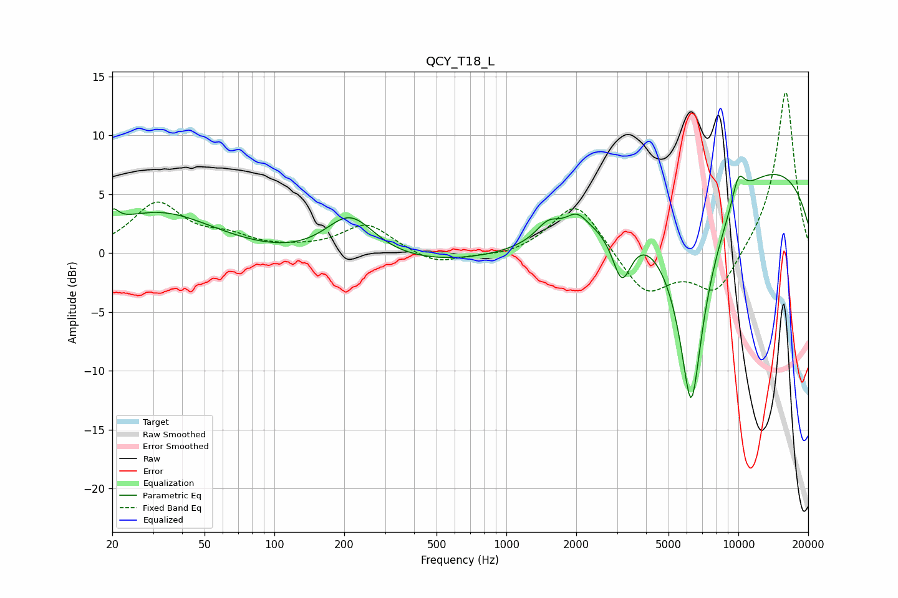

# QCY_T18_L
See [usage instructions](https://github.com/jaakkopasanen/AutoEq#usage) for more options and info.

### Parametric EQs
Apply preamp of -6.8 dB when using parametric equalizer.

|   # | Type    |   Fc (Hz) |    Q |   Gain (dB) |
|-----|---------|-----------|------|-------------|
|   1 | Peaking |        20 | 5.82 |         1.1 |
|   2 | Peaking |        32 | 0.59 |         3.5 |
|   3 | Peaking |       212 | 1.3  |         3.9 |
|   4 | Peaking |       498 | 0.18 |        -1.3 |
|   5 | Peaking |      1513 | 2.76 |         1.4 |
|   6 | Peaking |      2009 | 3.08 |         1.4 |
|   7 | Peaking |      3146 | 3.33 |        -4.5 |
|   8 | Peaking |      6262 | 1.93 |       -20   |
|   9 | Peaking |      9665 | 0.2  |         8.4 |
|  10 | Peaking |     10000 | 4.28 |         2.3 |

### Fixed Band EQs
When using fixed band (also called graphic) equalizer, apply preamp of **-13.7 dB** (if available) and set gains manually with these parameters.

|   # | Type    |   Fc (Hz) |    Q |   Gain (dB) |
|-----|---------|-----------|------|-------------|
|   1 | Peaking |        31 | 1.41 |         4.1 |
|   2 | Peaking |        62 | 1.41 |         1.1 |
|   3 | Peaking |       125 | 1.41 |         0.2 |
|   4 | Peaking |       250 | 1.41 |         2.4 |
|   5 | Peaking |       500 | 1.41 |        -1.1 |
|   6 | Peaking |      1000 | 1.41 |        -0.4 |
|   7 | Peaking |      2000 | 1.41 |         4.5 |
|   8 | Peaking |      4000 | 1.41 |        -3.6 |
|   9 | Peaking |      8000 | 1.41 |        -3.6 |
|  10 | Peaking |     16000 | 1.41 |        14   |

### Graphs

