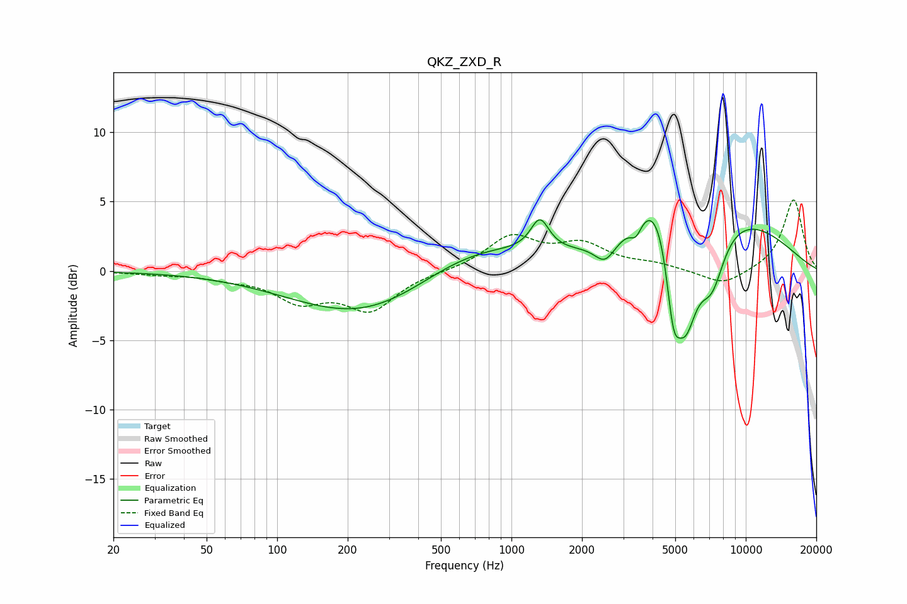

# QKZ_ZXD_R
See [usage instructions](https://github.com/jaakkopasanen/AutoEq#usage) for more options and info.

### Parametric EQs
Apply preamp of -3.8 dB when using parametric equalizer.

|   # | Type    |   Fc (Hz) |    Q |   Gain (dB) |
|-----|---------|-----------|------|-------------|
|   1 | Peaking |       256 | 0.44 |        -3.7 |
|   2 | Peaking |       640 | 0.52 |         2.7 |
|   3 | Peaking |      1322 | 3.65 |         2.3 |
|   4 | Peaking |      2511 | 3.16 |        -1.5 |
|   5 | Peaking |      3400 | 5.95 |        -1   |
|   6 | Peaking |      4185 | 1.61 |         4.1 |
|   7 | Peaking |      4900 | 4.7  |        -4.8 |
|   8 | Peaking |      5517 | 2.49 |        -7.4 |
|   9 | Peaking |      7162 | 2.36 |        -4.1 |
|  10 | Peaking |      7746 | 0.44 |         4.3 |

### Fixed Band EQs
When using fixed band (also called graphic) equalizer, apply preamp of **-5.2 dB** (if available) and set gains manually with these parameters.

|   # | Type    |   Fc (Hz) |    Q |   Gain (dB) |
|-----|---------|-----------|------|-------------|
|   1 | Peaking |        31 | 1.41 |        -0.2 |
|   2 | Peaking |        62 | 1.41 |        -0.4 |
|   3 | Peaking |       125 | 1.41 |        -2   |
|   4 | Peaking |       250 | 1.41 |        -2.7 |
|   5 | Peaking |       500 | 1.41 |        -0   |
|   6 | Peaking |      1000 | 1.41 |         2.4 |
|   7 | Peaking |      2000 | 1.41 |         1.7 |
|   8 | Peaking |      4000 | 1.41 |         0.4 |
|   9 | Peaking |      8000 | 1.41 |        -1.1 |
|  10 | Peaking |     16000 | 1.41 |         5.2 |

### Graphs

