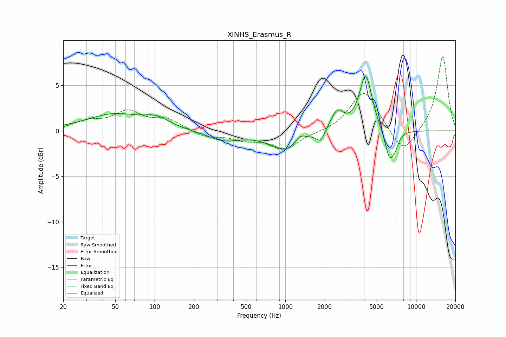

# XINHS_Erasmus_R
See [usage instructions](https://github.com/jaakkopasanen/AutoEq#usage) for more options and info.

### Parametric EQs
Apply preamp of -6.1 dB when using parametric equalizer.

|   # | Type    |   Fc (Hz) |    Q |   Gain (dB) |
|-----|---------|-----------|------|-------------|
|   1 | Peaking |        49 | 0.67 |         1.8 |
|   2 | Peaking |       104 | 1.48 |         1   |
|   3 | Peaking |       339 | 1.12 |        -1   |
|   4 | Peaking |      1003 | 1.19 |        -2.1 |
|   5 | Peaking |      1298 | 3.68 |         0.8 |
|   6 | Peaking |      1858 | 4.74 |        -1.2 |
|   7 | Peaking |      2497 | 2.92 |         2.1 |
|   8 | Peaking |      4123 | 2.91 |         6.2 |
|   9 | Peaking |      6281 | 3.65 |        -3.4 |
|  10 | Peaking |      6972 | 6    |        -0.8 |

### Fixed Band EQs
When using fixed band (also called graphic) equalizer, apply preamp of **-8.2 dB** (if available) and set gains manually with these parameters.

|   # | Type    |   Fc (Hz) |    Q |   Gain (dB) |
|-----|---------|-----------|------|-------------|
|   1 | Peaking |        31 | 1.41 |         0.9 |
|   2 | Peaking |        62 | 1.41 |         2   |
|   3 | Peaking |       125 | 1.41 |         1.2 |
|   4 | Peaking |       250 | 1.41 |        -0.7 |
|   5 | Peaking |       500 | 1.41 |        -0.8 |
|   6 | Peaking |      1000 | 1.41 |        -1.9 |
|   7 | Peaking |      2000 | 1.41 |        -0.1 |
|   8 | Peaking |      4000 | 1.41 |         4.5 |
|   9 | Peaking |      8000 | 1.41 |        -2.8 |
|  10 | Peaking |     16000 | 1.41 |         8.3 |

### Graphs

