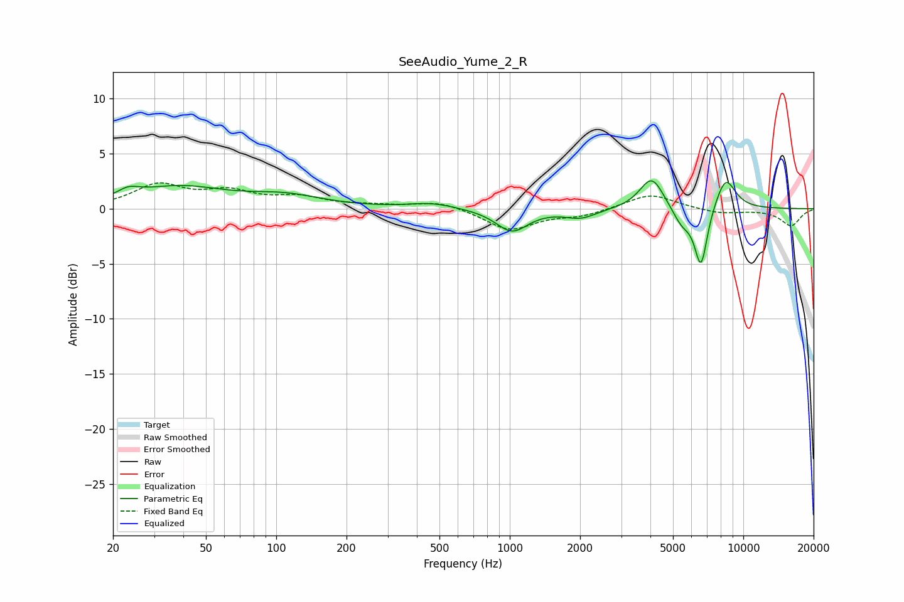

# SeeAudio_Yume_2_R
See [usage instructions](https://github.com/jaakkopasanen/AutoEq#usage) for more options and info.

### Parametric EQs
Apply preamp of -2.6 dB when using parametric equalizer.

|   # | Type    |   Fc (Hz) |    Q |   Gain (dB) |
|-----|---------|-----------|------|-------------|
|   1 | Peaking |        23 | 3.07 |         0.7 |
|   2 | Peaking |        38 | 0.71 |         1.9 |
|   3 | Peaking |       110 | 0.89 |         1   |
|   4 | Peaking |       464 | 1.45 |         0.5 |
|   5 | Peaking |      1022 | 2.07 |        -2.1 |
|   6 | Peaking |      2012 | 2.08 |        -0.8 |
|   7 | Peaking |      4056 | 2.71 |         3   |
|   8 | Peaking |      5464 | 3.32 |        -1.5 |
|   9 | Peaking |      6589 | 4.9  |        -5.4 |
|  10 | Peaking |      8395 | 2.95 |         2.9 |

### Fixed Band EQs
When using fixed band (also called graphic) equalizer, apply preamp of **-2.4 dB** (if available) and set gains manually with these parameters.

|   # | Type    |   Fc (Hz) |    Q |   Gain (dB) |
|-----|---------|-----------|------|-------------|
|   1 | Peaking |        31 | 1.41 |         2.1 |
|   2 | Peaking |        62 | 1.41 |         1.4 |
|   3 | Peaking |       125 | 1.41 |         0.9 |
|   4 | Peaking |       250 | 1.41 |         0.2 |
|   5 | Peaking |       500 | 1.41 |         0.7 |
|   6 | Peaking |      1000 | 1.41 |        -1.9 |
|   7 | Peaking |      2000 | 1.41 |        -0.6 |
|   8 | Peaking |      4000 | 1.41 |         1.4 |
|   9 | Peaking |      8000 | 1.41 |        -0.4 |
|  10 | Peaking |     16000 | 1.41 |        -1.5 |

### Graphs

