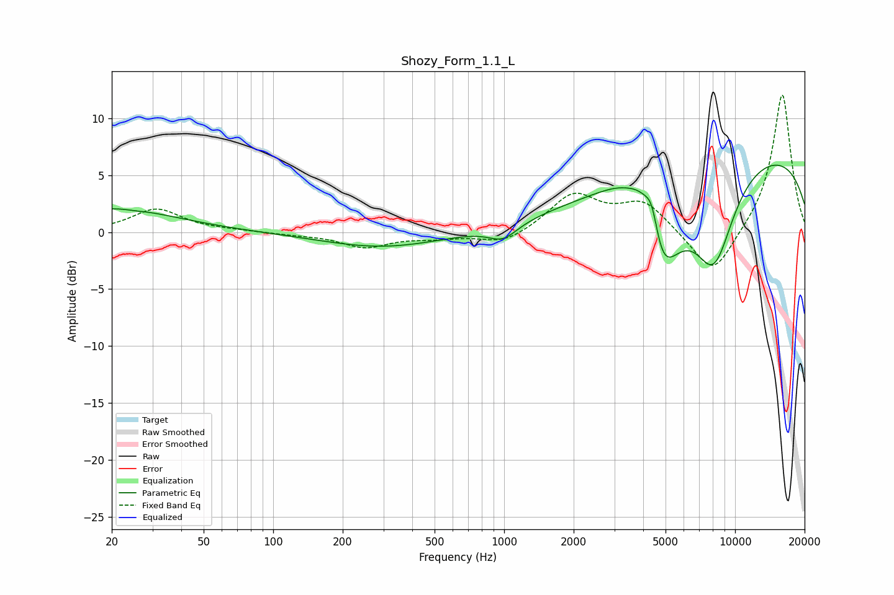

# Shozy_Form_1.1_L
See [usage instructions](https://github.com/jaakkopasanen/AutoEq#usage) for more options and info.

### Parametric EQs
Apply preamp of -6.0 dB when using parametric equalizer.

|   # | Type    |   Fc (Hz) |    Q |   Gain (dB) |
|-----|---------|-----------|------|-------------|
|   1 | Peaking |        20 | 0.52 |         2.1 |
|   2 | Peaking |        25 | 4.86 |        -0.1 |
|   3 | Peaking |       299 | 0.54 |        -1.4 |
|   4 | Peaking |       990 | 2.26 |        -1.3 |
|   5 | Peaking |      3510 | 1.26 |         2.7 |
|   6 | Peaking |      3943 | 2.67 |         2.3 |
|   7 | Peaking |      4373 | 4.32 |         4.1 |
|   8 | Peaking |      4654 | 1.5  |       -10.7 |
|   9 | Peaking |      8098 | 1.43 |        -8.3 |
|  10 | Peaking |     10000 | 0.19 |         7.5 |

### Fixed Band EQs
When using fixed band (also called graphic) equalizer, apply preamp of **-12.1 dB** (if available) and set gains manually with these parameters.

|   # | Type    |   Fc (Hz) |    Q |   Gain (dB) |
|-----|---------|-----------|------|-------------|
|   1 | Peaking |        31 | 1.41 |         2   |
|   2 | Peaking |        62 | 1.41 |         0.1 |
|   3 | Peaking |       125 | 1.41 |        -0.2 |
|   4 | Peaking |       250 | 1.41 |        -1.3 |
|   5 | Peaking |       500 | 1.41 |        -0.4 |
|   6 | Peaking |      1000 | 1.41 |        -1.1 |
|   7 | Peaking |      2000 | 1.41 |         3.2 |
|   8 | Peaking |      4000 | 1.41 |         2.6 |
|   9 | Peaking |      8000 | 1.41 |        -4.1 |
|  10 | Peaking |     16000 | 1.41 |        12.3 |

### Graphs

