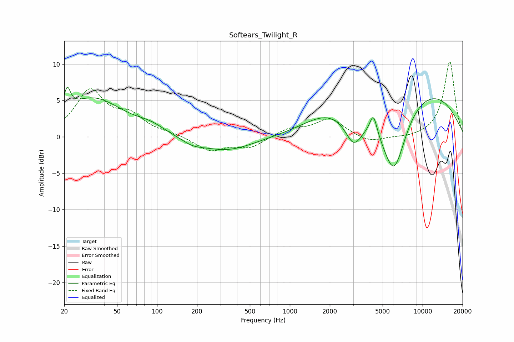

# Softears_Twilight_R
See [usage instructions](https://github.com/jaakkopasanen/AutoEq#usage) for more options and info.

### Parametric EQs
Apply preamp of -6.9 dB when using parametric equalizer.

|   # | Type    |   Fc (Hz) |    Q |   Gain (dB) |
|-----|---------|-----------|------|-------------|
|   1 | Peaking |        21 | 6    |         2.9 |
|   2 | Peaking |        33 | 0.63 |         5.2 |
|   3 | Peaking |        90 | 1.4  |         0.9 |
|   4 | Peaking |       185 | 1.72 |        -0.7 |
|   5 | Peaking |       334 | 0.7  |        -1.9 |
|   6 | Peaking |      1904 | 0.76 |         2.3 |
|   7 | Peaking |      3028 | 2.21 |        -3.8 |
|   8 | Peaking |      4258 | 5.14 |         2.9 |
|   9 | Peaking |      6073 | 1.43 |       -10.2 |
|  10 | Peaking |      9351 | 0.33 |         6.8 |

### Fixed Band EQs
When using fixed band (also called graphic) equalizer, apply preamp of **-10.4 dB** (if available) and set gains manually with these parameters.

|   # | Type    |   Fc (Hz) |    Q |   Gain (dB) |
|-----|---------|-----------|------|-------------|
|   1 | Peaking |        31 | 1.41 |         6.2 |
|   2 | Peaking |        62 | 1.41 |         2.5 |
|   3 | Peaking |       125 | 1.41 |         0.4 |
|   4 | Peaking |       250 | 1.41 |        -1.9 |
|   5 | Peaking |       500 | 1.41 |        -1.4 |
|   6 | Peaking |      1000 | 1.41 |         1.1 |
|   7 | Peaking |      2000 | 1.41 |         2.5 |
|   8 | Peaking |      4000 | 1.41 |        -0.9 |
|   9 | Peaking |      8000 | 1.41 |        -0.2 |
|  10 | Peaking |     16000 | 1.41 |        10.4 |

### Graphs

