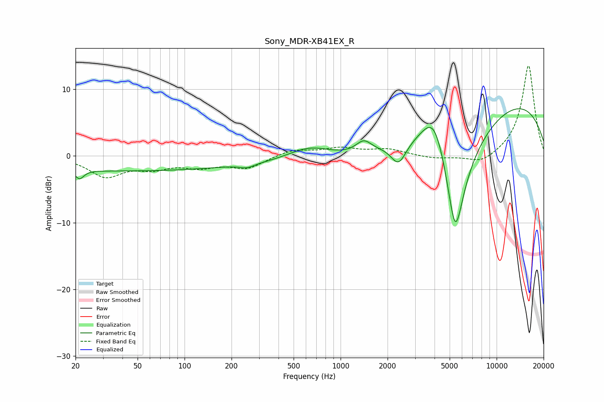

# Sony_MDR-XB41EX_R
See [usage instructions](https://github.com/jaakkopasanen/AutoEq#usage) for more options and info.

### Parametric EQs
Apply preamp of -7.2 dB when using parametric equalizer.

|   # | Type    |   Fc (Hz) |    Q |   Gain (dB) |
|-----|---------|-----------|------|-------------|
|   1 | Peaking |        21 | 5.34 |        -1.3 |
|   2 | Peaking |        40 | 0.18 |        -2.2 |
|   3 | Peaking |       252 | 3.1  |        -0.6 |
|   4 | Peaking |       634 | 0.89 |         3   |
|   5 | Peaking |      1406 | 2.89 |         1.7 |
|   6 | Peaking |      2094 | 0.21 |        -4.5 |
|   7 | Peaking |      2352 | 2.92 |        -3.2 |
|   8 | Peaking |      4001 | 1.61 |         7.7 |
|   9 | Peaking |      5431 | 1.63 |       -20   |
|  10 | Peaking |      7705 | 0.18 |        10.5 |

### Fixed Band EQs
When using fixed band (also called graphic) equalizer, apply preamp of **-13.6 dB** (if available) and set gains manually with these parameters.

|   # | Type    |   Fc (Hz) |    Q |   Gain (dB) |
|-----|---------|-----------|------|-------------|
|   1 | Peaking |        31 | 1.41 |        -2.9 |
|   2 | Peaking |        62 | 1.41 |        -1.5 |
|   3 | Peaking |       125 | 1.41 |        -1.4 |
|   4 | Peaking |       250 | 1.41 |        -1.8 |
|   5 | Peaking |       500 | 1.41 |         1   |
|   6 | Peaking |      1000 | 1.41 |         1.1 |
|   7 | Peaking |      2000 | 1.41 |         1   |
|   8 | Peaking |      4000 | 1.41 |        -0.4 |
|   9 | Peaking |      8000 | 1.41 |        -1.4 |
|  10 | Peaking |     16000 | 1.41 |        13.7 |

### Graphs

