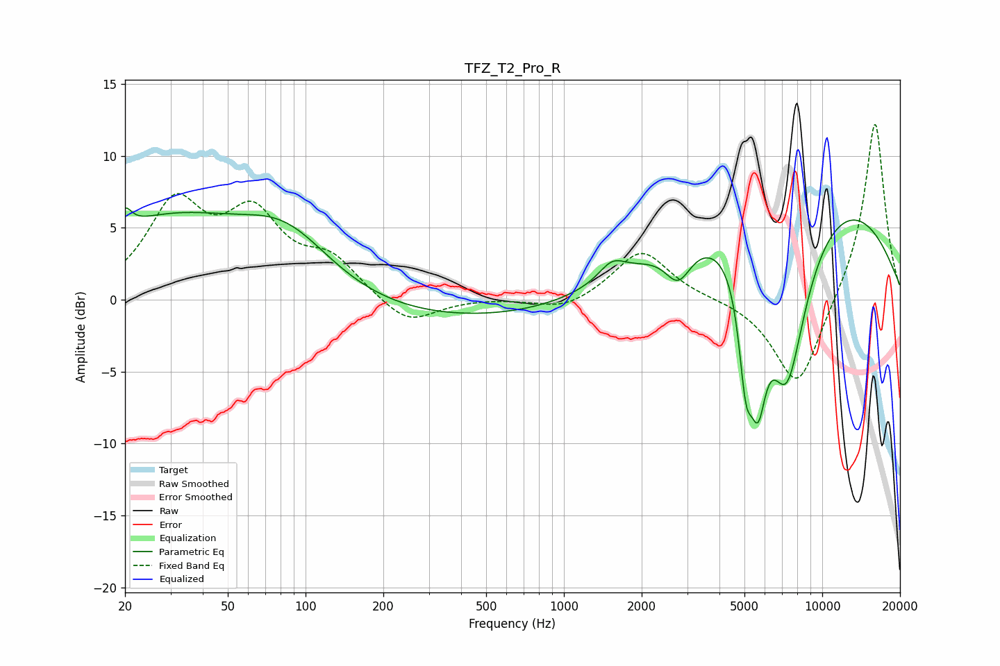

# TFZ_T2_Pro_R
See [usage instructions](https://github.com/jaakkopasanen/AutoEq#usage) for more options and info.

### Parametric EQs
Apply preamp of -6.5 dB when using parametric equalizer.

|   # | Type    |   Fc (Hz) |    Q |   Gain (dB) |
|-----|---------|-----------|------|-------------|
|   1 | Peaking |        20 | 5.72 |         1.3 |
|   2 | Peaking |        29 | 0.44 |         5.3 |
|   3 | Peaking |        85 | 0.77 |         3.9 |
|   4 | Peaking |       440 | 0.19 |        -1.7 |
|   5 | Peaking |      1536 | 2.74 |         1.3 |
|   6 | Peaking |      2772 | 2.76 |        -2.5 |
|   7 | Peaking |      5055 | 5.13 |        -6.3 |
|   8 | Peaking |      5639 | 4.1  |        -7.2 |
|   9 | Peaking |      7286 | 1.46 |       -13.6 |
|  10 | Peaking |      7709 | 0.27 |         9.4 |

### Fixed Band EQs
When using fixed band (also called graphic) equalizer, apply preamp of **-12.3 dB** (if available) and set gains manually with these parameters.

|   # | Type    |   Fc (Hz) |    Q |   Gain (dB) |
|-----|---------|-----------|------|-------------|
|   1 | Peaking |        31 | 1.41 |         6.3 |
|   2 | Peaking |        62 | 1.41 |         5.2 |
|   3 | Peaking |       125 | 1.41 |         2.5 |
|   4 | Peaking |       250 | 1.41 |        -1.9 |
|   5 | Peaking |       500 | 1.41 |         0.1 |
|   6 | Peaking |      1000 | 1.41 |        -0.8 |
|   7 | Peaking |      2000 | 1.41 |         3.5 |
|   8 | Peaking |      4000 | 1.41 |         0.1 |
|   9 | Peaking |      8000 | 1.41 |        -6.4 |
|  10 | Peaking |     16000 | 1.41 |        12.6 |

### Graphs

