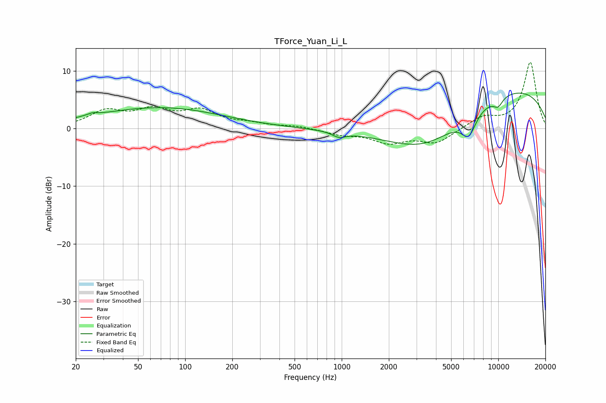

# TForce_Yuan_Li_L
See [usage instructions](https://github.com/jaakkopasanen/AutoEq#usage) for more options and info.

### Parametric EQs
Apply preamp of -6.2 dB when using parametric equalizer.

|   # | Type    |   Fc (Hz) |    Q |   Gain (dB) |
|-----|---------|-----------|------|-------------|
|   1 | Peaking |        24 | 1.83 |         0.3 |
|   2 | Peaking |        26 | 5.83 |         0.3 |
|   3 | Peaking |        67 | 0.34 |         3.1 |
|   4 | Peaking |        78 | 0.45 |         0.5 |
|   5 | Peaking |       960 | 3.14 |        -0.1 |
|   6 | Peaking |       961 | 3.34 |        -0.8 |
|   7 | Peaking |      3505 | 0.54 |        -7.1 |
|   8 | Peaking |      6472 | 2.92 |        -3.8 |
|   9 | Peaking |      9968 | 3.96 |        -1.5 |
|  10 | Peaking |      9998 | 0.23 |         7.5 |

### Fixed Band EQs
When using fixed band (also called graphic) equalizer, apply preamp of **-11.5 dB** (if available) and set gains manually with these parameters.

|   # | Type    |   Fc (Hz) |    Q |   Gain (dB) |
|-----|---------|-----------|------|-------------|
|   1 | Peaking |        31 | 1.41 |         2.8 |
|   2 | Peaking |        62 | 1.41 |         2.8 |
|   3 | Peaking |       125 | 1.41 |         2.8 |
|   4 | Peaking |       250 | 1.41 |         0.7 |
|   5 | Peaking |       500 | 1.41 |         0.4 |
|   6 | Peaking |      1000 | 1.41 |        -0.9 |
|   7 | Peaking |      2000 | 1.41 |        -2.3 |
|   8 | Peaking |      4000 | 1.41 |        -2.4 |
|   9 | Peaking |      8000 | 1.41 |         1.9 |
|  10 | Peaking |     16000 | 1.41 |        11.5 |

### Graphs

