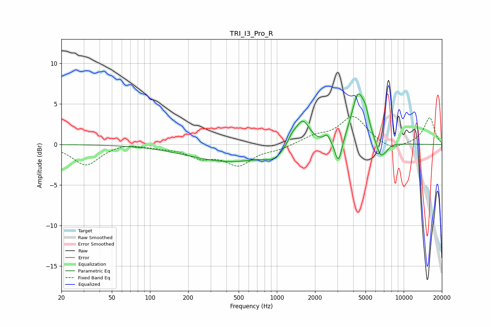

# TRI_I3_Pro_R
See [usage instructions](https://github.com/jaakkopasanen/AutoEq#usage) for more options and info.

### Parametric EQs
Apply preamp of -6.4 dB when using parametric equalizer.

|   # | Type    |   Fc (Hz) |    Q |   Gain (dB) |
|-----|---------|-----------|------|-------------|
|   1 | Peaking |       433 | 0.42 |        -2.1 |
|   2 | Peaking |       954 | 2.26 |        -0.9 |
|   3 | Peaking |      1320 | 3.94 |         0.9 |
|   4 | Peaking |      1598 | 2.48 |         3.3 |
|   5 | Peaking |      2485 | 5.97 |         0.9 |
|   6 | Peaking |      3061 | 5.15 |        -3.1 |
|   7 | Peaking |      4374 | 2.71 |         6.2 |
|   8 | Peaking |      5016 | 5.58 |         1.5 |
|   9 | Peaking |      6554 | 4.13 |        -2   |
|  10 | Peaking |      7305 | 5.01 |        -0.5 |

### Fixed Band EQs
When using fixed band (also called graphic) equalizer, apply preamp of **-3.5 dB** (if available) and set gains manually with these parameters.

|   # | Type    |   Fc (Hz) |    Q |   Gain (dB) |
|-----|---------|-----------|------|-------------|
|   1 | Peaking |        31 | 1.41 |        -2.6 |
|   2 | Peaking |        62 | 1.41 |         0.3 |
|   3 | Peaking |       125 | 1.41 |        -0.3 |
|   4 | Peaking |       250 | 1.41 |        -1.4 |
|   5 | Peaking |       500 | 1.41 |        -2.4 |
|   6 | Peaking |      1000 | 1.41 |        -0.5 |
|   7 | Peaking |      2000 | 1.41 |         0.9 |
|   8 | Peaking |      4000 | 1.41 |         3.4 |
|   9 | Peaking |      8000 | 1.41 |        -0.9 |
|  10 | Peaking |     16000 | 1.41 |         3.3 |

### Graphs

