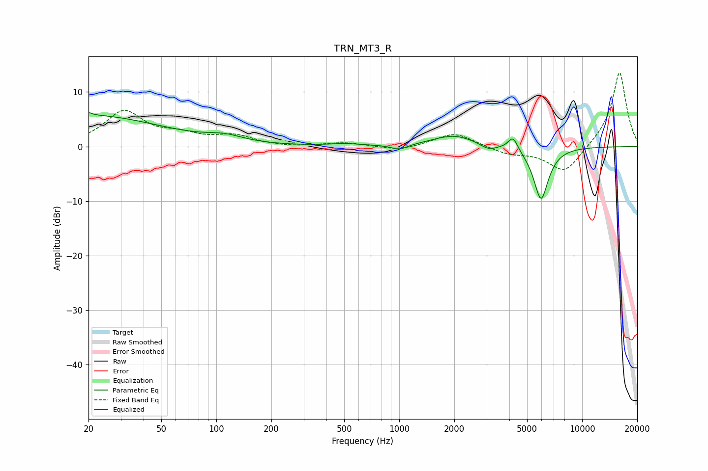

# TRN_MT3_R
See [usage instructions](https://github.com/jaakkopasanen/AutoEq#usage) for more options and info.

### Parametric EQs
Apply preamp of -6.4 dB when using parametric equalizer.

|   # | Type    |   Fc (Hz) |    Q |   Gain (dB) |
|-----|---------|-----------|------|-------------|
|   1 | Peaking |        20 | 5.99 |         3.2 |
|   2 | Peaking |        20 | 0.35 |         5.7 |
|   3 | Peaking |        20 | 5.97 |        -2.6 |
|   4 | Peaking |       111 | 1.42 |         1.1 |
|   5 | Peaking |       508 | 1.64 |         0.4 |
|   6 | Peaking |      1001 | 3.21 |        -1   |
|   7 | Peaking |      1995 | 1.22 |         2.1 |
|   8 | Peaking |      3067 | 3.22 |        -1   |
|   9 | Peaking |      4188 | 5.29 |         2.5 |
|  10 | Peaking |      5959 | 3.35 |        -9.8 |

### Fixed Band EQs
When using fixed band (also called graphic) equalizer, apply preamp of **-13.6 dB** (if available) and set gains manually with these parameters.

|   # | Type    |   Fc (Hz) |    Q |   Gain (dB) |
|-----|---------|-----------|------|-------------|
|   1 | Peaking |        31 | 1.41 |         6.3 |
|   2 | Peaking |        62 | 1.41 |         1.7 |
|   3 | Peaking |       125 | 1.41 |         1.8 |
|   4 | Peaking |       250 | 1.41 |        -0.2 |
|   5 | Peaking |       500 | 1.41 |         0.7 |
|   6 | Peaking |      1000 | 1.41 |        -0.8 |
|   7 | Peaking |      2000 | 1.41 |         2.6 |
|   8 | Peaking |      4000 | 1.41 |        -1.3 |
|   9 | Peaking |      8000 | 1.41 |        -5   |
|  10 | Peaking |     16000 | 1.41 |        13.9 |

### Graphs

