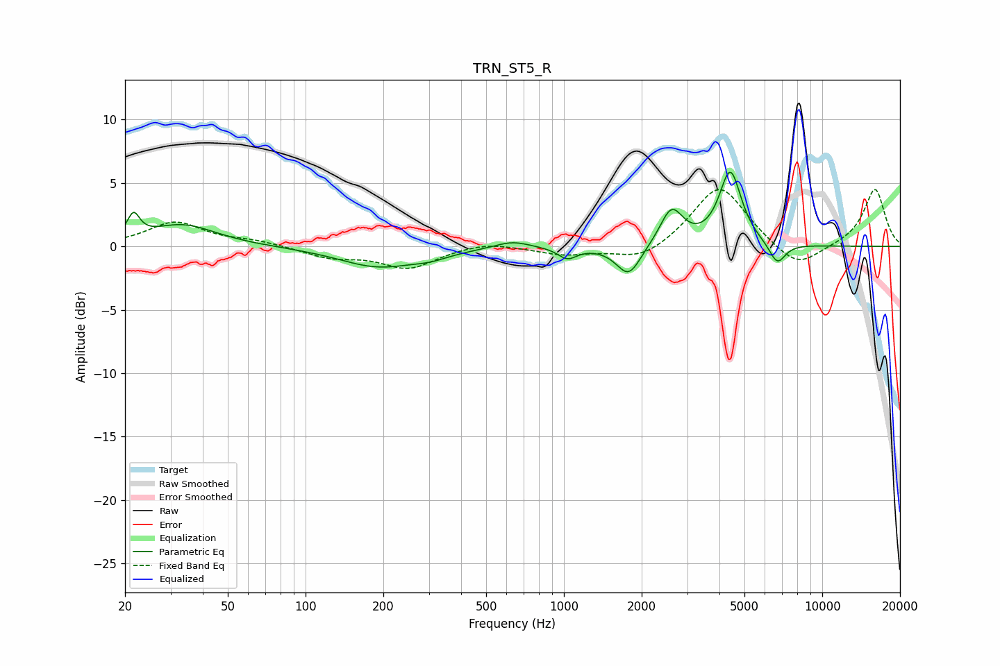

# TRN_ST5_R
See [usage instructions](https://github.com/jaakkopasanen/AutoEq#usage) for more options and info.

### Parametric EQs
Apply preamp of -5.9 dB when using parametric equalizer.

|   # | Type    |   Fc (Hz) |    Q |   Gain (dB) |
|-----|---------|-----------|------|-------------|
|   1 | Peaking |        22 | 6    |         1.8 |
|   2 | Peaking |        33 | 1.09 |         1.7 |
|   3 | Peaking |       191 | 0.92 |        -1.6 |
|   4 | Peaking |       306 | 1.97 |        -0.4 |
|   5 | Peaking |       630 | 2.09 |         0.6 |
|   6 | Peaking |      1031 | 3.87 |        -0.9 |
|   7 | Peaking |      1782 | 2.98 |        -2.4 |
|   8 | Peaking |      2609 | 3.2  |         2.9 |
|   9 | Peaking |      4407 | 3.3  |         5.8 |
|  10 | Peaking |      6697 | 4.29 |        -1.7 |

### Fixed Band EQs
When using fixed band (also called graphic) equalizer, apply preamp of **-4.6 dB** (if available) and set gains manually with these parameters.

|   # | Type    |   Fc (Hz) |    Q |   Gain (dB) |
|-----|---------|-----------|------|-------------|
|   1 | Peaking |        31 | 1.41 |         1.9 |
|   2 | Peaking |        62 | 1.41 |         0.4 |
|   3 | Peaking |       125 | 1.41 |        -0.8 |
|   4 | Peaking |       250 | 1.41 |        -1.7 |
|   5 | Peaking |       500 | 1.41 |         0.4 |
|   6 | Peaking |      1000 | 1.41 |        -0.6 |
|   7 | Peaking |      2000 | 1.41 |        -1.2 |
|   8 | Peaking |      4000 | 1.41 |         4.9 |
|   9 | Peaking |      8000 | 1.41 |        -1.9 |
|  10 | Peaking |     16000 | 1.41 |         4.6 |

### Graphs

