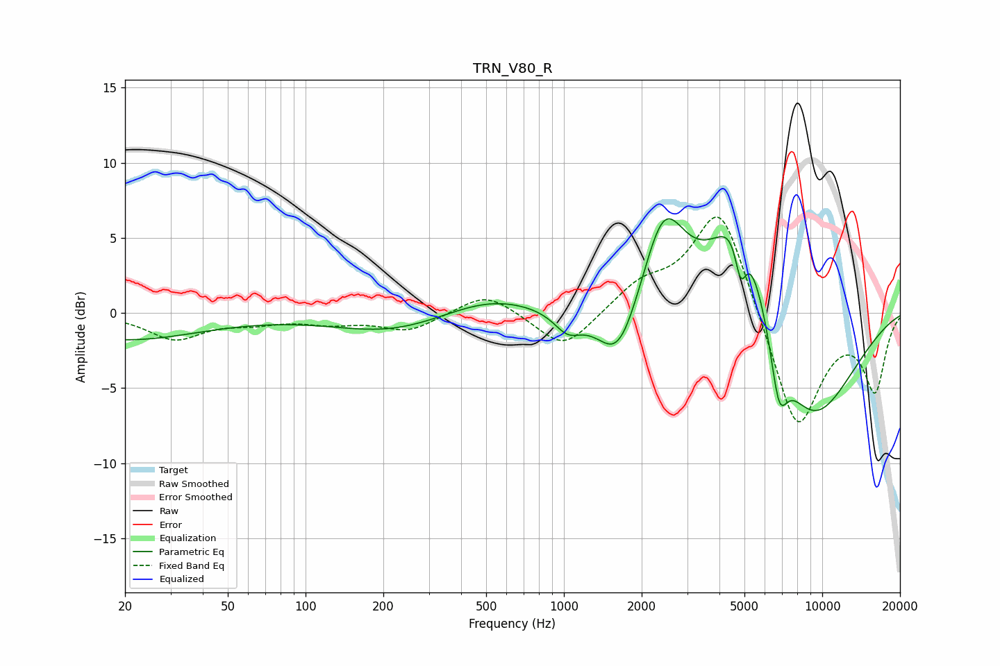

# TRN_V80_R
See [usage instructions](https://github.com/jaakkopasanen/AutoEq#usage) for more options and info.

### Parametric EQs
Apply preamp of -6.4 dB when using parametric equalizer.

|   # | Type    |   Fc (Hz) |    Q |   Gain (dB) |
|-----|---------|-----------|------|-------------|
|   1 | Peaking |        20 | 0.48 |        -1.8 |
|   2 | Peaking |       217 | 0.63 |        -1.3 |
|   3 | Peaking |       519 | 0.75 |         1.2 |
|   4 | Peaking |      1034 | 2.66 |        -1.3 |
|   5 | Peaking |      1629 | 1.72 |        -4.4 |
|   6 | Peaking |      2433 | 1.65 |         6.6 |
|   7 | Peaking |      4828 | 1.23 |         9   |
|   8 | Peaking |      4837 | 5.96 |        -3.3 |
|   9 | Peaking |      6800 | 4.11 |        -4.1 |
|  10 | Peaking |      8880 | 0.7  |        -8.1 |

### Fixed Band EQs
When using fixed band (also called graphic) equalizer, apply preamp of **-6.5 dB** (if available) and set gains manually with these parameters.

|   # | Type    |   Fc (Hz) |    Q |   Gain (dB) |
|-----|---------|-----------|------|-------------|
|   1 | Peaking |        31 | 1.41 |        -1.7 |
|   2 | Peaking |        62 | 1.41 |        -0.5 |
|   3 | Peaking |       125 | 1.41 |        -0.6 |
|   4 | Peaking |       250 | 1.41 |        -1.2 |
|   5 | Peaking |       500 | 1.41 |         1.5 |
|   6 | Peaking |      1000 | 1.41 |        -2.6 |
|   7 | Peaking |      2000 | 1.41 |         1.7 |
|   8 | Peaking |      4000 | 1.41 |         7.4 |
|   9 | Peaking |      8000 | 1.41 |        -8.1 |
|  10 | Peaking |     16000 | 1.41 |        -5   |

### Graphs

