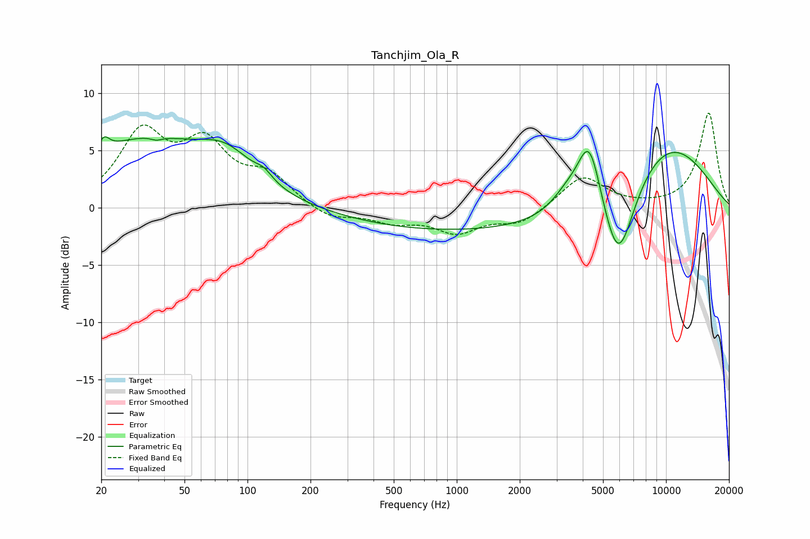

# Tanchjim_Ola_R
See [usage instructions](https://github.com/jaakkopasanen/AutoEq#usage) for more options and info.

### Parametric EQs
Apply preamp of -6.3 dB when using parametric equalizer.

|   # | Type    |   Fc (Hz) |    Q |   Gain (dB) |
|-----|---------|-----------|------|-------------|
|   1 | Peaking |        21 | 5.69 |         1.1 |
|   2 | Peaking |        31 | 0.45 |         5.7 |
|   3 | Peaking |        37 | 5.75 |        -0.3 |
|   4 | Peaking |        79 | 1.07 |         2.8 |
|   5 | Peaking |       120 | 3.51 |         0.7 |
|   6 | Peaking |      1396 | 0.19 |        -2.2 |
|   7 | Peaking |      3332 | 1.97 |         1.3 |
|   8 | Peaking |      4297 | 2.37 |         6.4 |
|   9 | Peaking |      5908 | 1.71 |        -8.1 |
|  10 | Peaking |      9608 | 0.5  |         6.3 |

### Fixed Band EQs
When using fixed band (also called graphic) equalizer, apply preamp of **-8.4 dB** (if available) and set gains manually with these parameters.

|   # | Type    |   Fc (Hz) |    Q |   Gain (dB) |
|-----|---------|-----------|------|-------------|
|   1 | Peaking |        31 | 1.41 |         6.2 |
|   2 | Peaking |        62 | 1.41 |         5   |
|   3 | Peaking |       125 | 1.41 |         2.5 |
|   4 | Peaking |       250 | 1.41 |        -1.1 |
|   5 | Peaking |       500 | 1.41 |        -1.1 |
|   6 | Peaking |      1000 | 1.41 |        -2   |
|   7 | Peaking |      2000 | 1.41 |        -1.3 |
|   8 | Peaking |      4000 | 1.41 |         2.8 |
|   9 | Peaking |      8000 | 1.41 |         0.1 |
|  10 | Peaking |     16000 | 1.41 |         8.3 |

### Graphs

