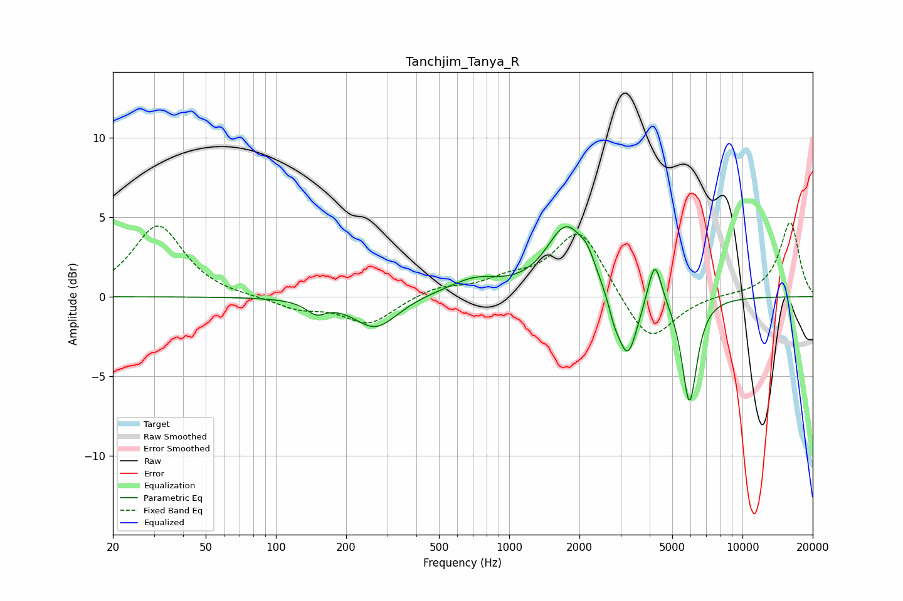

# Tanchjim_Tanya_R
See [usage instructions](https://github.com/jaakkopasanen/AutoEq#usage) for more options and info.

### Parametric EQs
Apply preamp of -4.5 dB when using parametric equalizer.

|   # | Type    |   Fc (Hz) |    Q |   Gain (dB) |
|-----|---------|-----------|------|-------------|
|   1 | Peaking |       149 | 3.35 |        -0.8 |
|   2 | Peaking |       267 | 1.52 |        -2   |
|   3 | Peaking |       460 | 1.55 |         0.1 |
|   4 | Peaking |       712 | 1.28 |         1   |
|   5 | Peaking |      1760 | 1.68 |         4.3 |
|   6 | Peaking |      2166 | 4.35 |         0.9 |
|   7 | Peaking |      2818 | 5.8  |        -0.9 |
|   8 | Peaking |      3217 | 3.29 |        -4.2 |
|   9 | Peaking |      4209 | 4.85 |         2.9 |
|  10 | Peaking |      5926 | 4.31 |        -6.7 |

### Fixed Band EQs
When using fixed band (also called graphic) equalizer, apply preamp of **-4.8 dB** (if available) and set gains manually with these parameters.

|   # | Type    |   Fc (Hz) |    Q |   Gain (dB) |
|-----|---------|-----------|------|-------------|
|   1 | Peaking |        31 | 1.41 |         4.5 |
|   2 | Peaking |        62 | 1.41 |        -0   |
|   3 | Peaking |       125 | 1.41 |        -0.7 |
|   4 | Peaking |       250 | 1.41 |        -1.7 |
|   5 | Peaking |       500 | 1.41 |         0.6 |
|   6 | Peaking |      1000 | 1.41 |         0.8 |
|   7 | Peaking |      2000 | 1.41 |         4.3 |
|   8 | Peaking |      4000 | 1.41 |        -3.1 |
|   9 | Peaking |      8000 | 1.41 |         0.1 |
|  10 | Peaking |     16000 | 1.41 |         4.7 |

### Graphs

