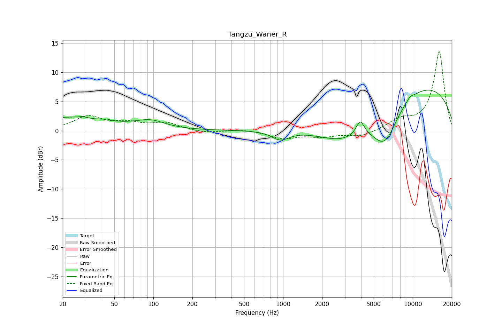

# Tangzu_Waner_R
See [usage instructions](https://github.com/jaakkopasanen/AutoEq#usage) for more options and info.

### Parametric EQs
Apply preamp of -7.0 dB when using parametric equalizer.

|   # | Type    |   Fc (Hz) |    Q |   Gain (dB) |
|-----|---------|-----------|------|-------------|
|   1 | Peaking |        22 | 0.46 |         2.2 |
|   2 | Peaking |        28 | 5.94 |         0.2 |
|   3 | Peaking |        44 | 5.94 |         0.2 |
|   4 | Peaking |        95 | 1.25 |         1.4 |
|   5 | Peaking |       954 | 2.06 |        -1.6 |
|   6 | Peaking |      2992 | 0.57 |        -6.9 |
|   7 | Peaking |      3934 | 4.5  |         2.6 |
|   8 | Peaking |      6099 | 1.35 |        -6.8 |
|   9 | Peaking |      8392 | 0.19 |         8.8 |
|  10 | Peaking |      9538 | 5.98 |         0.5 |

### Fixed Band EQs
When using fixed band (also called graphic) equalizer, apply preamp of **-13.6 dB** (if available) and set gains manually with these parameters.

|   # | Type    |   Fc (Hz) |    Q |   Gain (dB) |
|-----|---------|-----------|------|-------------|
|   1 | Peaking |        31 | 1.41 |         2.3 |
|   2 | Peaking |        62 | 1.41 |         1.1 |
|   3 | Peaking |       125 | 1.41 |         1.2 |
|   4 | Peaking |       250 | 1.41 |        -0.4 |
|   5 | Peaking |       500 | 1.41 |         0.3 |
|   6 | Peaking |      1000 | 1.41 |        -1.3 |
|   7 | Peaking |      2000 | 1.41 |        -0.9 |
|   8 | Peaking |      4000 | 1.41 |        -1   |
|   9 | Peaking |      8000 | 1.41 |         1.6 |
|  10 | Peaking |     16000 | 1.41 |        13.6 |

### Graphs

