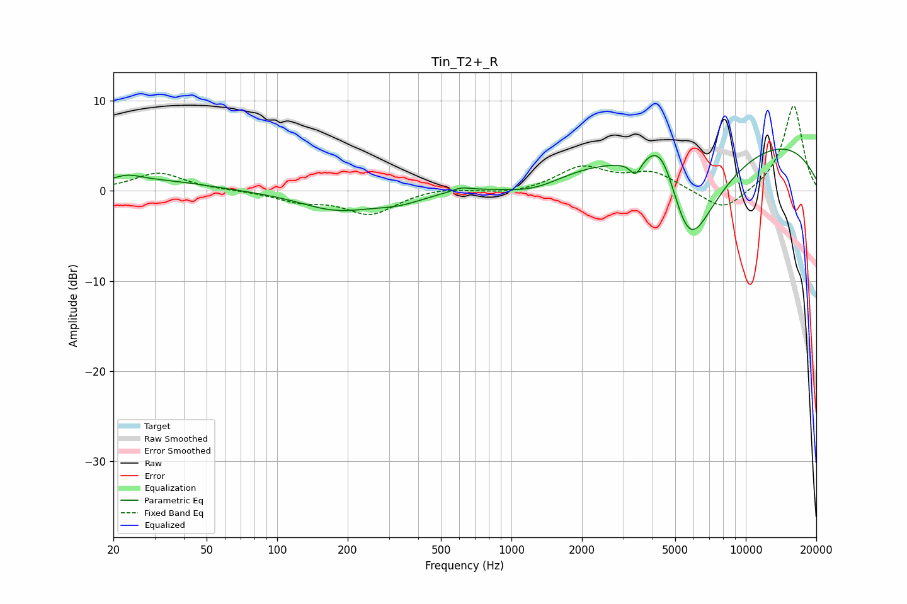

# Tin_T2+_R
See [usage instructions](https://github.com/jaakkopasanen/AutoEq#usage) for more options and info.

### Parametric EQs
Apply preamp of -4.7 dB when using parametric equalizer.

|   # | Type    |   Fc (Hz) |    Q |   Gain (dB) |
|-----|---------|-----------|------|-------------|
|   1 | Peaking |        23 | 1.98 |         1.1 |
|   2 | Peaking |        34 | 0.73 |         1   |
|   3 | Peaking |       179 | 0.9  |        -2   |
|   4 | Peaking |       330 | 1.25 |        -1   |
|   5 | Peaking |       608 | 3.74 |         0.4 |
|   6 | Peaking |      1247 | 0.98 |        -2   |
|   7 | Peaking |      3390 | 5.8  |        -1.7 |
|   8 | Peaking |      4383 | 1.71 |         7.1 |
|   9 | Peaking |      5672 | 1.03 |       -14.7 |
|  10 | Peaking |      7303 | 0.18 |         7.3 |

### Fixed Band EQs
When using fixed band (also called graphic) equalizer, apply preamp of **-9.5 dB** (if available) and set gains manually with these parameters.

|   # | Type    |   Fc (Hz) |    Q |   Gain (dB) |
|-----|---------|-----------|------|-------------|
|   1 | Peaking |        31 | 1.41 |         2   |
|   2 | Peaking |        62 | 1.41 |         0   |
|   3 | Peaking |       125 | 1.41 |        -1   |
|   4 | Peaking |       250 | 1.41 |        -2.5 |
|   5 | Peaking |       500 | 1.41 |         0.4 |
|   6 | Peaking |      1000 | 1.41 |        -0.4 |
|   7 | Peaking |      2000 | 1.41 |         2.5 |
|   8 | Peaking |      4000 | 1.41 |         1.9 |
|   9 | Peaking |      8000 | 1.41 |        -2.5 |
|  10 | Peaking |     16000 | 1.41 |         9.6 |

### Graphs

