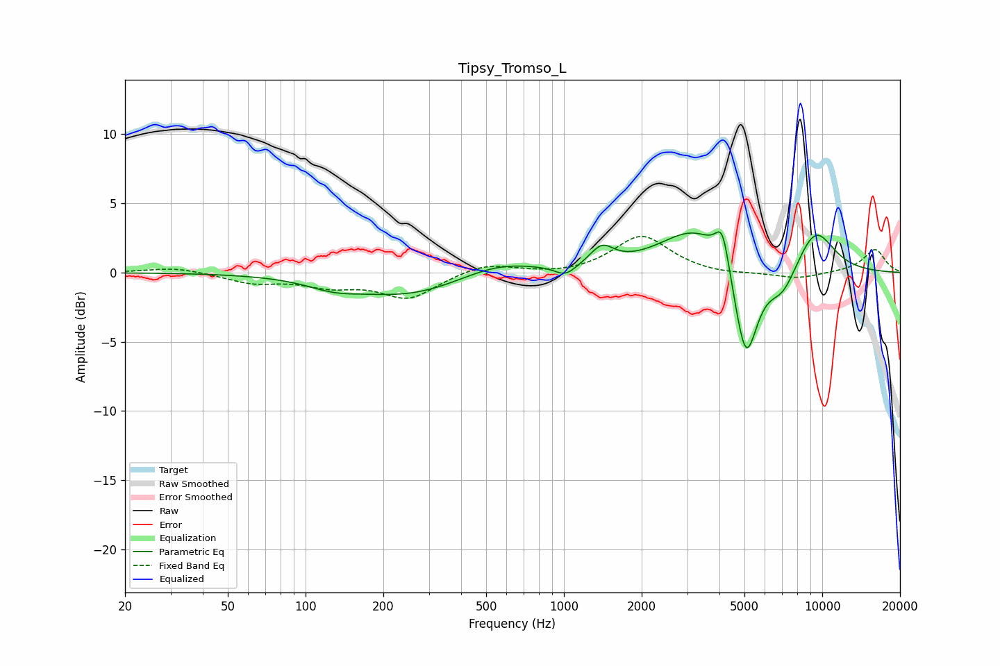

# Tipsy_Tromso_L
See [usage instructions](https://github.com/jaakkopasanen/AutoEq#usage) for more options and info.

### Parametric EQs
Apply preamp of -3.0 dB when using parametric equalizer.

|   # | Type    |   Fc (Hz) |    Q |   Gain (dB) |
|-----|---------|-----------|------|-------------|
|   1 | Peaking |       128 | 1.39 |        -0.6 |
|   2 | Peaking |       250 | 0.65 |        -1.6 |
|   3 | Peaking |       556 | 0.95 |         1   |
|   4 | Peaking |      1015 | 3.4  |        -0.8 |
|   5 | Peaking |      1403 | 3.06 |         1.4 |
|   6 | Peaking |      3266 | 1.01 |         3.3 |
|   7 | Peaking |      4109 | 5.27 |         2.7 |
|   8 | Peaking |      5060 | 2.95 |        -7.4 |
|   9 | Peaking |      7023 | 2.34 |        -2.1 |
|  10 | Peaking |      9392 | 1.67 |         3.2 |

### Fixed Band EQs
When using fixed band (also called graphic) equalizer, apply preamp of **-2.7 dB** (if available) and set gains manually with these parameters.

|   # | Type    |   Fc (Hz) |    Q |   Gain (dB) |
|-----|---------|-----------|------|-------------|
|   1 | Peaking |        31 | 1.41 |         0.4 |
|   2 | Peaking |        62 | 1.41 |        -0.7 |
|   3 | Peaking |       125 | 1.41 |        -0.8 |
|   4 | Peaking |       250 | 1.41 |        -1.8 |
|   5 | Peaking |       500 | 1.41 |         0.7 |
|   6 | Peaking |      1000 | 1.41 |        -0.2 |
|   7 | Peaking |      2000 | 1.41 |         2.7 |
|   8 | Peaking |      4000 | 1.41 |        -0.2 |
|   9 | Peaking |      8000 | 1.41 |        -0.5 |
|  10 | Peaking |     16000 | 1.41 |         1.7 |

### Graphs

