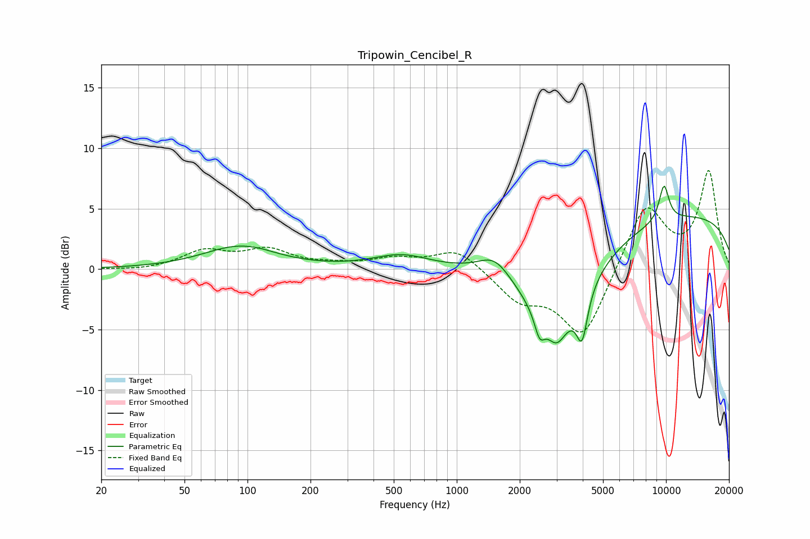

# Tripowin_Cencibel_R
See [usage instructions](https://github.com/jaakkopasanen/AutoEq#usage) for more options and info.

### Parametric EQs
Apply preamp of -7.0 dB when using parametric equalizer.

|   # | Type    |   Fc (Hz) |    Q |   Gain (dB) |
|-----|---------|-----------|------|-------------|
|   1 | Peaking |        92 | 0.83 |         1.8 |
|   2 | Peaking |       115 | 2.5  |         0   |
|   3 | Peaking |       543 | 1.06 |         1.1 |
|   4 | Peaking |      1522 | 1.81 |         1.8 |
|   5 | Peaking |      2488 | 5.88 |        -1.8 |
|   6 | Peaking |      3005 | 3.31 |        -1.8 |
|   7 | Peaking |      3029 | 0.83 |        -7.1 |
|   8 | Peaking |      3970 | 5.38 |        -3.7 |
|   9 | Peaking |      9780 | 5.13 |         3   |
|  10 | Peaking |     10000 | 0.18 |         4.7 |

### Fixed Band EQs
When using fixed band (also called graphic) equalizer, apply preamp of **-8.2 dB** (if available) and set gains manually with these parameters.

|   # | Type    |   Fc (Hz) |    Q |   Gain (dB) |
|-----|---------|-----------|------|-------------|
|   1 | Peaking |        31 | 1.41 |        -0.1 |
|   2 | Peaking |        62 | 1.41 |         1.4 |
|   3 | Peaking |       125 | 1.41 |         1.5 |
|   4 | Peaking |       250 | 1.41 |         0.3 |
|   5 | Peaking |       500 | 1.41 |         0.8 |
|   6 | Peaking |      1000 | 1.41 |         1.7 |
|   7 | Peaking |      2000 | 1.41 |        -2.4 |
|   8 | Peaking |      4000 | 1.41 |        -5.7 |
|   9 | Peaking |      8000 | 1.41 |         5.5 |
|  10 | Peaking |     16000 | 1.41 |         8   |

### Graphs

