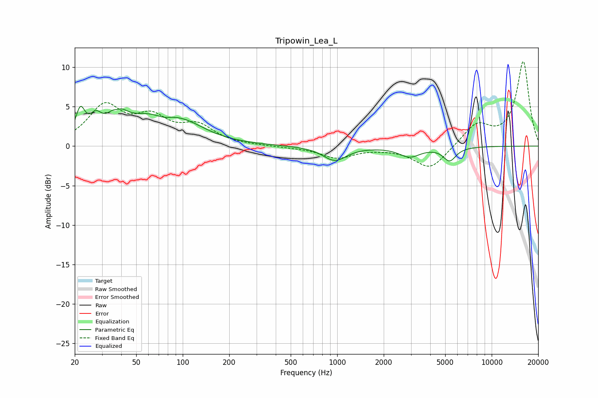

# Tripowin_Lea_L
See [usage instructions](https://github.com/jaakkopasanen/AutoEq#usage) for more options and info.

### Parametric EQs
Apply preamp of -5.1 dB when using parametric equalizer.

|   # | Type    |   Fc (Hz) |    Q |   Gain (dB) |
|-----|---------|-----------|------|-------------|
|   1 | Peaking |        22 | 4.84 |         3.4 |
|   2 | Peaking |        27 | 3.65 |         2   |
|   3 | Peaking |        38 | 3.21 |         4.6 |
|   4 | Peaking |        38 | 4.34 |        -2.7 |
|   5 | Peaking |        65 | 0.7  |         3.8 |
|   6 | Peaking |        75 | 2.52 |        -0.7 |
|   7 | Peaking |       107 | 1.13 |         0.9 |
|   8 | Peaking |       964 | 1.86 |        -1.8 |
|   9 | Peaking |      2943 | 2.06 |        -1.3 |
|  10 | Peaking |      5343 | 3.4  |        -1.7 |

### Fixed Band EQs
When using fixed band (also called graphic) equalizer, apply preamp of **-10.8 dB** (if available) and set gains manually with these parameters.

|   # | Type    |   Fc (Hz) |    Q |   Gain (dB) |
|-----|---------|-----------|------|-------------|
|   1 | Peaking |        31 | 1.41 |         4.8 |
|   2 | Peaking |        62 | 1.41 |         3.1 |
|   3 | Peaking |       125 | 1.41 |         2.3 |
|   4 | Peaking |       250 | 1.41 |         0   |
|   5 | Peaking |       500 | 1.41 |        -0.1 |
|   6 | Peaking |      1000 | 1.41 |        -1.4 |
|   7 | Peaking |      2000 | 1.41 |        -0.1 |
|   8 | Peaking |      4000 | 1.41 |        -3   |
|   9 | Peaking |      8000 | 1.41 |         2.7 |
|  10 | Peaking |     16000 | 1.41 |        10.7 |

### Graphs

