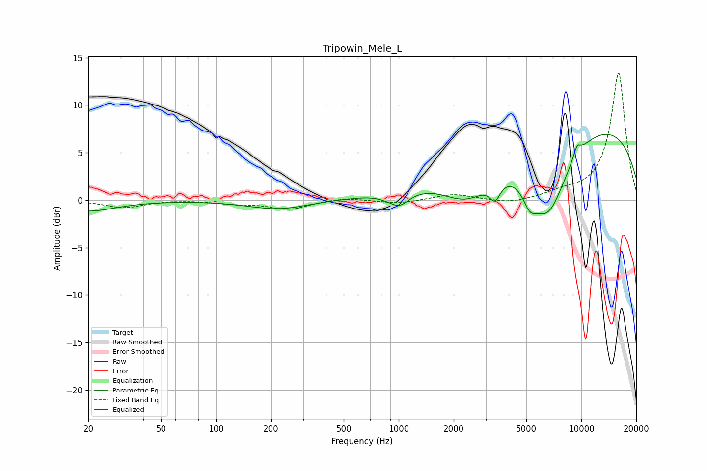

# Tripowin_Mele_L
See [usage instructions](https://github.com/jaakkopasanen/AutoEq#usage) for more options and info.

### Parametric EQs
Apply preamp of -7.0 dB when using parametric equalizer.

|   # | Type    |   Fc (Hz) |    Q |   Gain (dB) |
|-----|---------|-----------|------|-------------|
|   1 | Peaking |        20 | 0.94 |        -1.1 |
|   2 | Peaking |       219 | 0.86 |        -1   |
|   3 | Peaking |       825 | 3.52 |        -0.1 |
|   4 | Peaking |      1005 | 2.6  |        -1.5 |
|   5 | Peaking |      2386 | 0.97 |        -4.3 |
|   6 | Peaking |      3370 | 4.82 |        -1.9 |
|   7 | Peaking |      5209 | 3.84 |        -1.8 |
|   8 | Peaking |      6515 | 1.15 |        -8.9 |
|   9 | Peaking |      8648 | 0.19 |         8.8 |
|  10 | Peaking |      9463 | 5.85 |         1.2 |

### Fixed Band EQs
When using fixed band (also called graphic) equalizer, apply preamp of **-13.5 dB** (if available) and set gains manually with these parameters.

|   # | Type    |   Fc (Hz) |    Q |   Gain (dB) |
|-----|---------|-----------|------|-------------|
|   1 | Peaking |        31 | 1.41 |        -0.8 |
|   2 | Peaking |        62 | 1.41 |         0.1 |
|   3 | Peaking |       125 | 1.41 |        -0.3 |
|   4 | Peaking |       250 | 1.41 |        -0.9 |
|   5 | Peaking |       500 | 1.41 |         0.3 |
|   6 | Peaking |      1000 | 1.41 |        -0.4 |
|   7 | Peaking |      2000 | 1.41 |         0.6 |
|   8 | Peaking |      4000 | 1.41 |        -0.4 |
|   9 | Peaking |      8000 | 1.41 |         0.6 |
|  10 | Peaking |     16000 | 1.41 |        13.5 |

### Graphs

