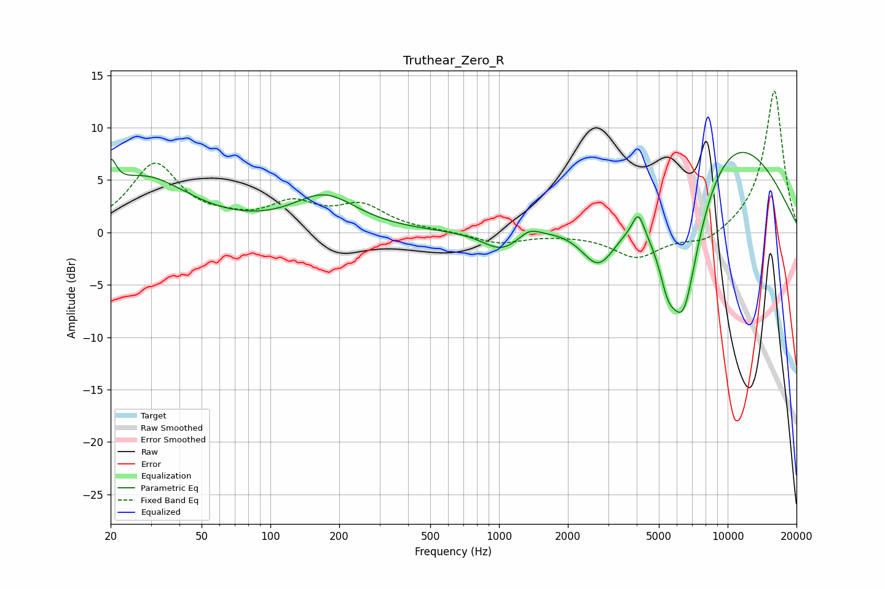

# Truthear_Zero_R
See [usage instructions](https://github.com/jaakkopasanen/AutoEq#usage) for more options and info.

### Parametric EQs
Apply preamp of -7.7 dB when using parametric equalizer.

|   # | Type    |   Fc (Hz) |    Q |   Gain (dB) |
|-----|---------|-----------|------|-------------|
|   1 | Peaking |        20 | 5.87 |         2.8 |
|   2 | Peaking |        28 | 0.72 |         5.2 |
|   3 | Peaking |       173 | 1.02 |         3.3 |
|   4 | Peaking |      1028 | 1.7  |        -1.9 |
|   5 | Peaking |      1353 | 3.16 |         0.8 |
|   6 | Peaking |      2727 | 1.8  |        -4.5 |
|   7 | Peaking |      4065 | 5.43 |         2.2 |
|   8 | Peaking |      5463 | 3.76 |        -3.2 |
|   9 | Peaking |      6403 | 1.56 |       -15.3 |
|  10 | Peaking |      9280 | 0.42 |        11.1 |

### Fixed Band EQs
When using fixed band (also called graphic) equalizer, apply preamp of **-13.6 dB** (if available) and set gains manually with these parameters.

|   # | Type    |   Fc (Hz) |    Q |   Gain (dB) |
|-----|---------|-----------|------|-------------|
|   1 | Peaking |        31 | 1.41 |         6.4 |
|   2 | Peaking |        62 | 1.41 |         0.7 |
|   3 | Peaking |       125 | 1.41 |         2.4 |
|   4 | Peaking |       250 | 1.41 |         2.3 |
|   5 | Peaking |       500 | 1.41 |         0.1 |
|   6 | Peaking |      1000 | 1.41 |        -1   |
|   7 | Peaking |      2000 | 1.41 |        -0.1 |
|   8 | Peaking |      4000 | 1.41 |        -2.4 |
|   9 | Peaking |      8000 | 1.41 |        -1.2 |
|  10 | Peaking |     16000 | 1.41 |        13.7 |

### Graphs

