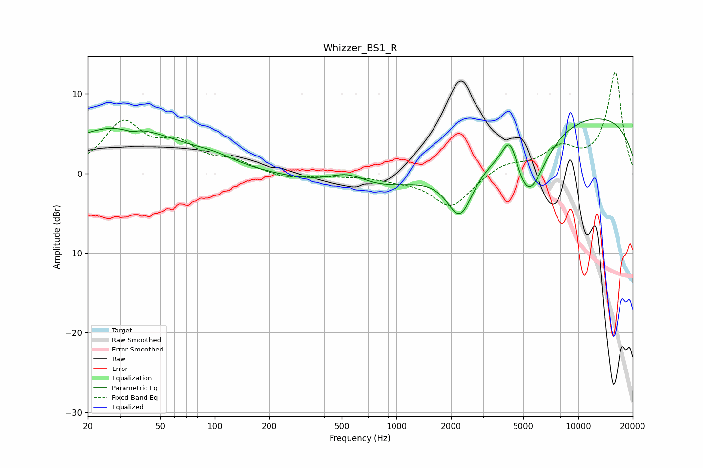

# Whizzer_BS1_R
See [usage instructions](https://github.com/jaakkopasanen/AutoEq#usage) for more options and info.

### Parametric EQs
Apply preamp of -6.9 dB when using parametric equalizer.

|   # | Type    |   Fc (Hz) |    Q |   Gain (dB) |
|-----|---------|-----------|------|-------------|
|   1 | Peaking |        30 | 0.42 |         5.8 |
|   2 | Peaking |        33 | 5.59 |         2.6 |
|   3 | Peaking |        33 | 5.09 |        -3.1 |
|   4 | Peaking |        99 | 1.31 |         0.7 |
|   5 | Peaking |       538 | 1.32 |         1.8 |
|   6 | Peaking |       762 | 0.43 |        -2.6 |
|   7 | Peaking |      2241 | 1.83 |        -7   |
|   8 | Peaking |      4228 | 3.19 |         4.6 |
|   9 | Peaking |      5308 | 1.4  |        -9.2 |
|  10 | Peaking |      9656 | 0.2  |         7.7 |

### Fixed Band EQs
When using fixed band (also called graphic) equalizer, apply preamp of **-12.8 dB** (if available) and set gains manually with these parameters.

|   # | Type    |   Fc (Hz) |    Q |   Gain (dB) |
|-----|---------|-----------|------|-------------|
|   1 | Peaking |        31 | 1.41 |         6.1 |
|   2 | Peaking |        62 | 1.41 |         3.1 |
|   3 | Peaking |       125 | 1.41 |         1.3 |
|   4 | Peaking |       250 | 1.41 |        -0.7 |
|   5 | Peaking |       500 | 1.41 |        -0.2 |
|   6 | Peaking |      1000 | 1.41 |        -0.6 |
|   7 | Peaking |      2000 | 1.41 |        -4.2 |
|   8 | Peaking |      4000 | 1.41 |         1.3 |
|   9 | Peaking |      8000 | 1.41 |         2.8 |
|  10 | Peaking |     16000 | 1.41 |        12.6 |

### Graphs

