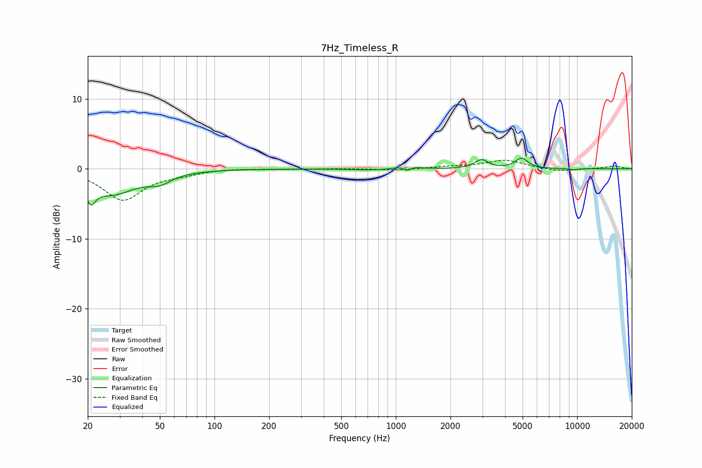

# 7Hz_Timeless_R
See [usage instructions](https://github.com/jaakkopasanen/AutoEq#usage) for more options and info.

### Parametric EQs
Apply preamp of -1.6 dB when using parametric equalizer.

|   # | Type    |   Fc (Hz) |    Q |   Gain (dB) |
|-----|---------|-----------|------|-------------|
|   1 | Peaking |        21 | 5.76 |        -2.4 |
|   2 | Peaking |        27 | 1    |        -3.5 |
|   3 | Peaking |        50 | 2.35 |        -1.1 |
|   4 | Peaking |       719 | 1.46 |        -0.2 |
|   5 | Peaking |      1011 | 5.99 |         0.1 |
|   6 | Peaking |      1164 | 5.97 |        -1.2 |
|   7 | Peaking |      1172 | 4.15 |         1.1 |
|   8 | Peaking |      2965 | 4.04 |         1.3 |
|   9 | Peaking |      4931 | 4.07 |         1.5 |
|  10 | Peaking |      9497 | 5.14 |        -0.2 |

### Fixed Band EQs
When using fixed band (also called graphic) equalizer, apply preamp of **-1.3 dB** (if available) and set gains manually with these parameters.

|   # | Type    |   Fc (Hz) |    Q |   Gain (dB) |
|-----|---------|-----------|------|-------------|
|   1 | Peaking |        31 | 1.41 |        -4.4 |
|   2 | Peaking |        62 | 1.41 |        -0.6 |
|   3 | Peaking |       125 | 1.41 |         0.1 |
|   4 | Peaking |       250 | 1.41 |        -0.1 |
|   5 | Peaking |       500 | 1.41 |         0   |
|   6 | Peaking |      1000 | 1.41 |        -0.2 |
|   7 | Peaking |      2000 | 1.41 |         0.3 |
|   8 | Peaking |      4000 | 1.41 |         1.2 |
|   9 | Peaking |      8000 | 1.41 |        -0.4 |
|  10 | Peaking |     16000 | 1.41 |         0.4 |

### Graphs

