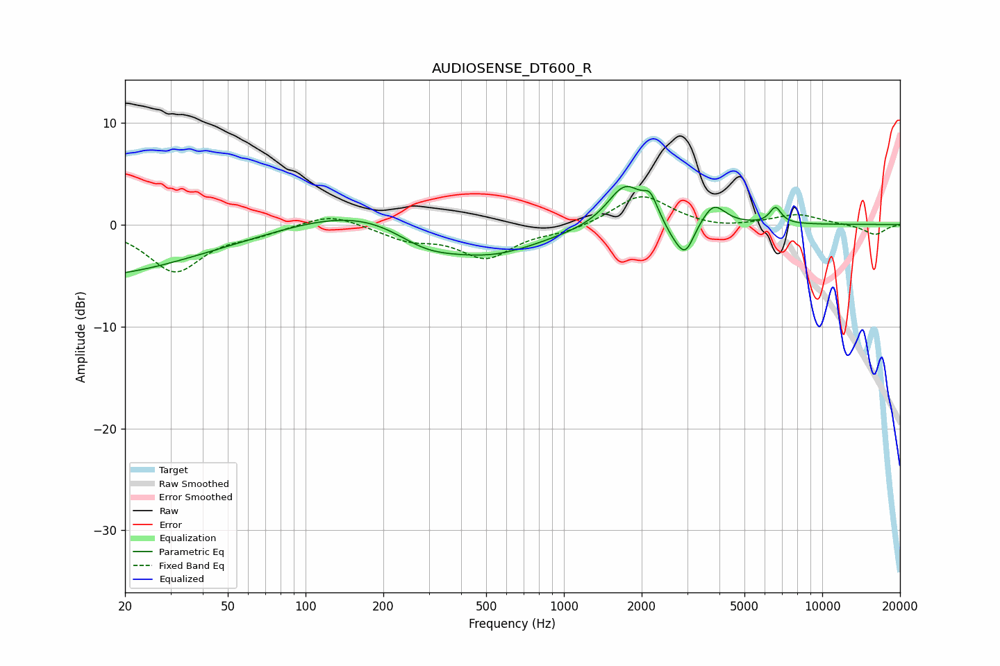

# AUDIOSENSE_DT600_R
See [usage instructions](https://github.com/jaakkopasanen/AutoEq#usage) for more options and info.

### Parametric EQs
Apply preamp of -3.8 dB when using parametric equalizer.

|   # | Type    |   Fc (Hz) |    Q |   Gain (dB) |
|-----|---------|-----------|------|-------------|
|   1 | Peaking |        27 | 0.22 |        -7.2 |
|   2 | Peaking |       101 | 0.23 |         5.2 |
|   3 | Peaking |       289 | 1.05 |        -2.5 |
|   4 | Peaking |       503 | 0.65 |        -4   |
|   5 | Peaking |      1728 | 2.03 |         4.1 |
|   6 | Peaking |      2160 | 5.19 |         1.8 |
|   7 | Peaking |      2650 | 3.45 |        -1.2 |
|   8 | Peaking |      2955 | 4.14 |        -2.9 |
|   9 | Peaking |      3801 | 3.2  |         2.1 |
|  10 | Peaking |      6592 | 6    |         1.6 |

### Fixed Band EQs
When using fixed band (also called graphic) equalizer, apply preamp of **-2.8 dB** (if available) and set gains manually with these parameters.

|   # | Type    |   Fc (Hz) |    Q |   Gain (dB) |
|-----|---------|-----------|------|-------------|
|   1 | Peaking |        31 | 1.41 |        -4.5 |
|   2 | Peaking |        62 | 1.41 |        -0.7 |
|   3 | Peaking |       125 | 1.41 |         1.2 |
|   4 | Peaking |       250 | 1.41 |        -1.3 |
|   5 | Peaking |       500 | 1.41 |        -3.1 |
|   6 | Peaking |      1000 | 1.41 |        -0.6 |
|   7 | Peaking |      2000 | 1.41 |         3   |
|   8 | Peaking |      4000 | 1.41 |        -0.4 |
|   9 | Peaking |      8000 | 1.41 |         1   |
|  10 | Peaking |     16000 | 1.41 |        -1   |

### Graphs

