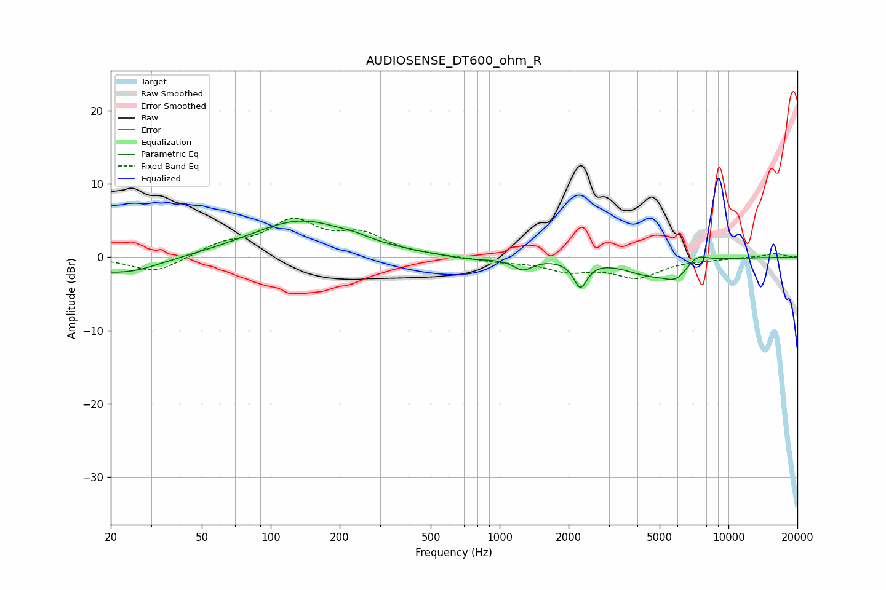

# AUDIOSENSE_DT600_ohm_R
See [usage instructions](https://github.com/jaakkopasanen/AutoEq#usage) for more options and info.

### Parametric EQs
Apply preamp of -5.0 dB when using parametric equalizer.

|   # | Type    |   Fc (Hz) |    Q |   Gain (dB) |
|-----|---------|-----------|------|-------------|
|   1 | Peaking |        20 | 5.03 |        -0.2 |
|   2 | Peaking |        23 | 0.92 |        -2.3 |
|   3 | Peaking |       135 | 0.65 |         5   |
|   4 | Peaking |       234 | 2.39 |         0.3 |
|   5 | Peaking |       732 | 1.36 |        -0.5 |
|   6 | Peaking |      1264 | 3.35 |        -1.5 |
|   7 | Peaking |      2254 | 4.85 |        -3.6 |
|   8 | Peaking |      4442 | 1.28 |        -2   |
|   9 | Peaking |      5951 | 2.4  |        -2.2 |
|  10 | Peaking |      7212 | 2.74 |         1.5 |

### Fixed Band EQs
When using fixed band (also called graphic) equalizer, apply preamp of **-5.4 dB** (if available) and set gains manually with these parameters.

|   # | Type    |   Fc (Hz) |    Q |   Gain (dB) |
|-----|---------|-----------|------|-------------|
|   1 | Peaking |        31 | 1.41 |        -2.2 |
|   2 | Peaking |        62 | 1.41 |         1.7 |
|   3 | Peaking |       125 | 1.41 |         4.6 |
|   4 | Peaking |       250 | 1.41 |         2.8 |
|   5 | Peaking |       500 | 1.41 |         0.1 |
|   6 | Peaking |      1000 | 1.41 |        -0.5 |
|   7 | Peaking |      2000 | 1.41 |        -1.7 |
|   8 | Peaking |      4000 | 1.41 |        -2.6 |
|   9 | Peaking |      8000 | 1.41 |        -0.2 |
|  10 | Peaking |     16000 | 1.41 |         0.5 |

### Graphs

