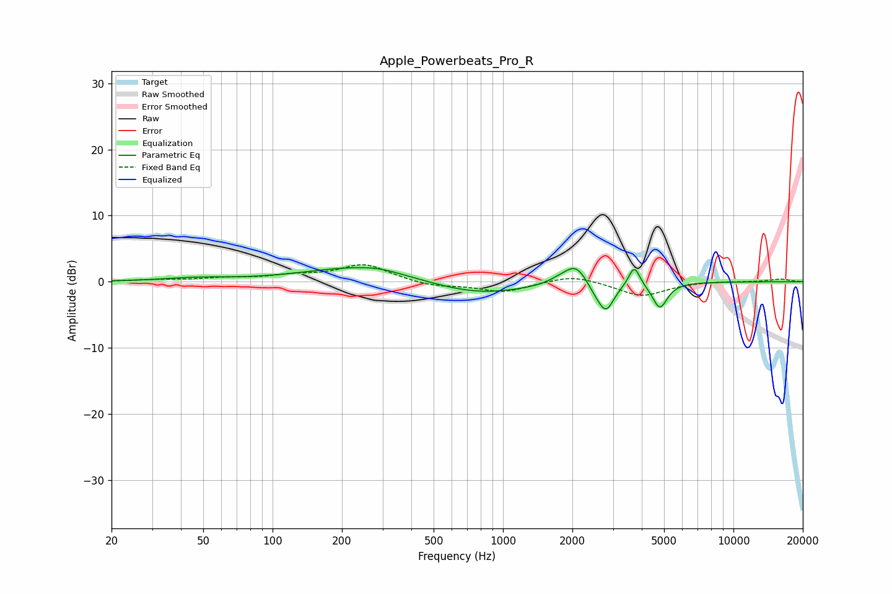

# Apple_Powerbeats_Pro_R
See [usage instructions](https://github.com/jaakkopasanen/AutoEq#usage) for more options and info.

### Parametric EQs
Apply preamp of -2.2 dB when using parametric equalizer.

|   # | Type    |   Fc (Hz) |    Q |   Gain (dB) |
|-----|---------|-----------|------|-------------|
|   1 | Peaking |        47 | 1.02 |         0.5 |
|   2 | Peaking |       237 | 0.6  |         2.2 |
|   3 | Peaking |       289 | 1.59 |         0.4 |
|   4 | Peaking |       778 | 0.67 |        -2   |
|   5 | Peaking |      1796 | 2.47 |         0.8 |
|   6 | Peaking |      2083 | 2.95 |         2.8 |
|   7 | Peaking |      2548 | 3.36 |        -1.2 |
|   8 | Peaking |      2804 | 4.09 |        -3.8 |
|   9 | Peaking |      3713 | 5.94 |         3.1 |
|  10 | Peaking |      4795 | 4.37 |        -3.9 |

### Fixed Band EQs
When using fixed band (also called graphic) equalizer, apply preamp of **-2.7 dB** (if available) and set gains manually with these parameters.

|   # | Type    |   Fc (Hz) |    Q |   Gain (dB) |
|-----|---------|-----------|------|-------------|
|   1 | Peaking |        31 | 1.41 |         0.2 |
|   2 | Peaking |        62 | 1.41 |         0.5 |
|   3 | Peaking |       125 | 1.41 |         0.8 |
|   4 | Peaking |       250 | 1.41 |         2.6 |
|   5 | Peaking |       500 | 1.41 |        -0.7 |
|   6 | Peaking |      1000 | 1.41 |        -1.5 |
|   7 | Peaking |      2000 | 1.41 |         1.1 |
|   8 | Peaking |      4000 | 1.41 |        -2.2 |
|   9 | Peaking |      8000 | 1.41 |         0.1 |
|  10 | Peaking |     16000 | 1.41 |         0.4 |

### Graphs

