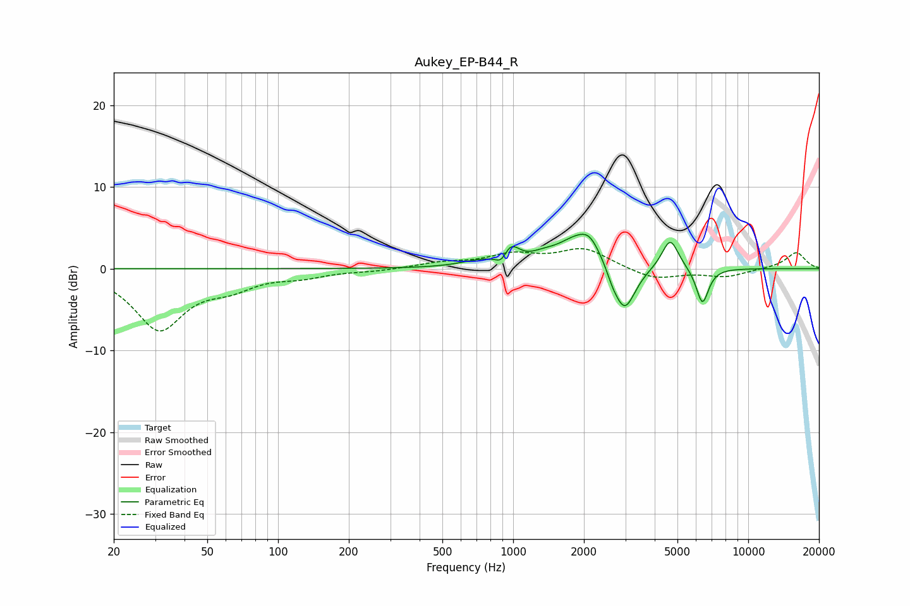

# Aukey_EP-B44_R
See [usage instructions](https://github.com/jaakkopasanen/AutoEq#usage) for more options and info.

### Parametric EQs
Apply preamp of -4.3 dB when using parametric equalizer.

|   # | Type    |   Fc (Hz) |    Q |   Gain (dB) |
|-----|---------|-----------|------|-------------|
|   1 | Peaking |       714 | 1.78 |         0.7 |
|   2 | Peaking |       893 | 6    |        -1.2 |
|   3 | Peaking |       976 | 4    |         2.1 |
|   4 | Peaking |      1339 | 2.95 |         0.5 |
|   5 | Peaking |      1960 | 1.44 |         4.2 |
|   6 | Peaking |      2118 | 3.9  |         1   |
|   7 | Peaking |      2641 | 5.6  |        -0.9 |
|   8 | Peaking |      2972 | 2.93 |        -6.2 |
|   9 | Peaking |      4658 | 3.95 |         3.8 |
|  10 | Peaking |      6383 | 5.16 |        -4.5 |

### Fixed Band EQs
When using fixed band (also called graphic) equalizer, apply preamp of **-2.5 dB** (if available) and set gains manually with these parameters.

|   # | Type    |   Fc (Hz) |    Q |   Gain (dB) |
|-----|---------|-----------|------|-------------|
|   1 | Peaking |        31 | 1.41 |        -7.3 |
|   2 | Peaking |        62 | 1.41 |        -1.8 |
|   3 | Peaking |       125 | 1.41 |        -0.8 |
|   4 | Peaking |       250 | 1.41 |        -0.2 |
|   5 | Peaking |       500 | 1.41 |         0.7 |
|   6 | Peaking |      1000 | 1.41 |         1.6 |
|   7 | Peaking |      2000 | 1.41 |         2.4 |
|   8 | Peaking |      4000 | 1.41 |        -1.4 |
|   9 | Peaking |      8000 | 1.41 |        -0.9 |
|  10 | Peaking |     16000 | 1.41 |         2   |

### Graphs

