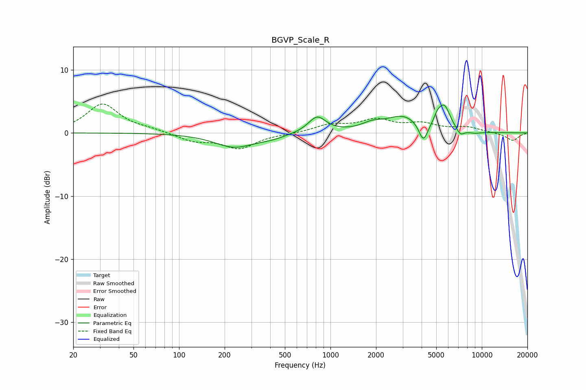

# BGVP_Scale_R
See [usage instructions](https://github.com/jaakkopasanen/AutoEq#usage) for more options and info.

### Parametric EQs
Apply preamp of -4.5 dB when using parametric equalizer.

|   # | Type    |   Fc (Hz) |    Q |   Gain (dB) |
|-----|---------|-----------|------|-------------|
|   1 | Peaking |       231 | 1.08 |        -2.2 |
|   2 | Peaking |       407 | 1.49 |        -0.6 |
|   3 | Peaking |       817 | 2.43 |         2.6 |
|   4 | Peaking |      1883 | 2.04 |         1   |
|   5 | Peaking |      3027 | 1.25 |         2.5 |
|   6 | Peaking |      4109 | 4.77 |        -3.1 |
|   7 | Peaking |      5092 | 6    |         1.2 |
|   8 | Peaking |      5657 | 3.55 |         3.7 |
|   9 | Peaking |      7214 | 5.24 |        -1   |
|  10 | Peaking |      8888 | 2.71 |        -0.3 |

### Fixed Band EQs
When using fixed band (also called graphic) equalizer, apply preamp of **-4.7 dB** (if available) and set gains manually with these parameters.

|   # | Type    |   Fc (Hz) |    Q |   Gain (dB) |
|-----|---------|-----------|------|-------------|
|   1 | Peaking |        31 | 1.41 |         4.5 |
|   2 | Peaking |        62 | 1.41 |         0.5 |
|   3 | Peaking |       125 | 1.41 |        -1.2 |
|   4 | Peaking |       250 | 1.41 |        -2.4 |
|   5 | Peaking |       500 | 1.41 |        -0.1 |
|   6 | Peaking |      1000 | 1.41 |         1.2 |
|   7 | Peaking |      2000 | 1.41 |         1.9 |
|   8 | Peaking |      4000 | 1.41 |         1.3 |
|   9 | Peaking |      8000 | 1.41 |         0.8 |
|  10 | Peaking |     16000 | 1.41 |        -1.2 |

### Graphs

