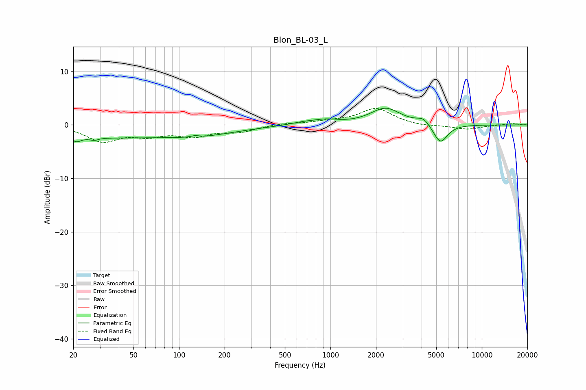

# Blon_BL-03_L
See [usage instructions](https://github.com/jaakkopasanen/AutoEq#usage) for more options and info.

### Parametric EQs
Apply preamp of -3.2 dB when using parametric equalizer.

|   # | Type    |   Fc (Hz) |    Q |   Gain (dB) |
|-----|---------|-----------|------|-------------|
|   1 | Peaking |        21 | 4.82 |        -0.9 |
|   2 | Peaking |        27 | 5.14 |        -0.5 |
|   3 | Peaking |        40 | 0.18 |        -2.4 |
|   4 | Peaking |       127 | 5.99 |         0.3 |
|   5 | Peaking |       145 | 0.91 |        -0.5 |
|   6 | Peaking |       680 | 1.39 |         0.6 |
|   7 | Peaking |       949 | 1.89 |         0.6 |
|   8 | Peaking |      2312 | 1.42 |         3.1 |
|   9 | Peaking |      4115 | 3.23 |         1.3 |
|  10 | Peaking |      5318 | 2.93 |        -3.7 |

### Fixed Band EQs
When using fixed band (also called graphic) equalizer, apply preamp of **-3.2 dB** (if available) and set gains manually with these parameters.

|   # | Type    |   Fc (Hz) |    Q |   Gain (dB) |
|-----|---------|-----------|------|-------------|
|   1 | Peaking |        31 | 1.41 |        -2.9 |
|   2 | Peaking |        62 | 1.41 |        -1.6 |
|   3 | Peaking |       125 | 1.41 |        -1.8 |
|   4 | Peaking |       250 | 1.41 |        -1.2 |
|   5 | Peaking |       500 | 1.41 |         0.3 |
|   6 | Peaking |      1000 | 1.41 |         0.5 |
|   7 | Peaking |      2000 | 1.41 |         3   |
|   8 | Peaking |      4000 | 1.41 |        -0.3 |
|   9 | Peaking |      8000 | 1.41 |        -0.8 |
|  10 | Peaking |     16000 | 1.41 |         0.3 |

### Graphs

