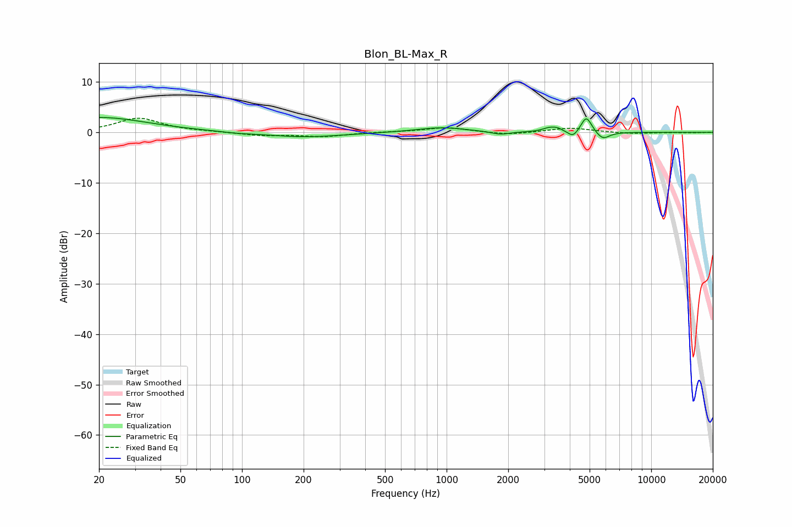

# Blon_BL-Max_R
See [usage instructions](https://github.com/jaakkopasanen/AutoEq#usage) for more options and info.

### Parametric EQs
Apply preamp of -3.1 dB when using parametric equalizer.

|   # | Type    |   Fc (Hz) |    Q |   Gain (dB) |
|-----|---------|-----------|------|-------------|
|   1 | Peaking |        20 | 0.6  |         3   |
|   2 | Peaking |        94 | 2.36 |        -0.2 |
|   3 | Peaking |       200 | 0.74 |        -1   |
|   4 | Peaking |       941 | 1.17 |         1   |
|   5 | Peaking |      1833 | 3.14 |        -0.6 |
|   6 | Peaking |      3182 | 4.13 |         0.8 |
|   7 | Peaking |      3482 | 5.91 |         0.5 |
|   8 | Peaking |      4152 | 5.94 |        -1.3 |
|   9 | Peaking |      4820 | 5.42 |         3.3 |
|  10 | Peaking |      5794 | 4.24 |        -1.5 |

### Fixed Band EQs
When using fixed band (also called graphic) equalizer, apply preamp of **-2.9 dB** (if available) and set gains manually with these parameters.

|   # | Type    |   Fc (Hz) |    Q |   Gain (dB) |
|-----|---------|-----------|------|-------------|
|   1 | Peaking |        31 | 1.41 |         2.8 |
|   2 | Peaking |        62 | 1.41 |         0.1 |
|   3 | Peaking |       125 | 1.41 |        -0.6 |
|   4 | Peaking |       250 | 1.41 |        -0.8 |
|   5 | Peaking |       500 | 1.41 |         0.1 |
|   6 | Peaking |      1000 | 1.41 |         1   |
|   7 | Peaking |      2000 | 1.41 |        -0.5 |
|   8 | Peaking |      4000 | 1.41 |         0.9 |
|   9 | Peaking |      8000 | 1.41 |        -0.3 |
|  10 | Peaking |     16000 | 1.41 |        -0.1 |

### Graphs

