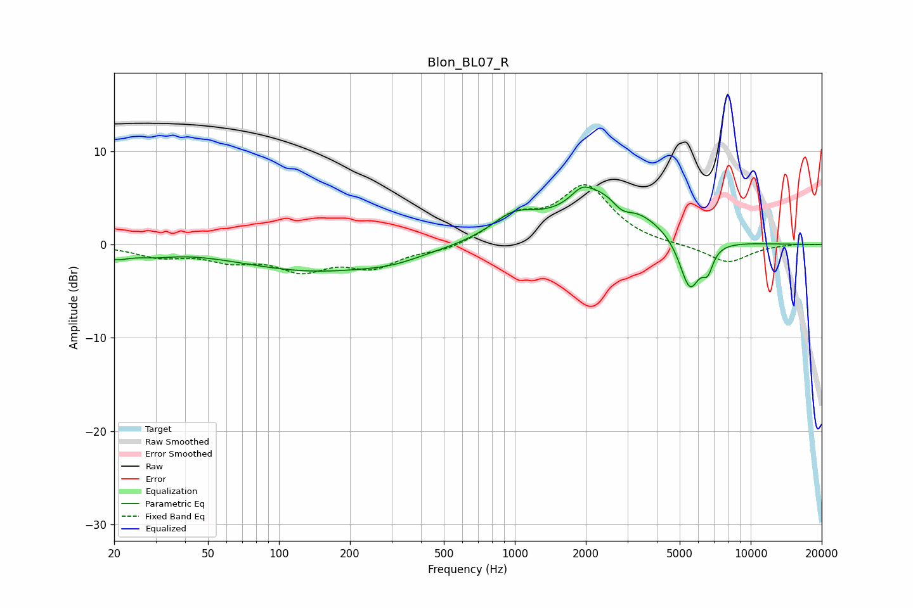

# Blon_BL07_R
See [usage instructions](https://github.com/jaakkopasanen/AutoEq#usage) for more options and info.

### Parametric EQs
Apply preamp of -6.3 dB when using parametric equalizer.

|   # | Type    |   Fc (Hz) |    Q |   Gain (dB) |
|-----|---------|-----------|------|-------------|
|   1 | Peaking |        20 | 2.33 |        -1.1 |
|   2 | Peaking |        29 | 1.63 |        -0.6 |
|   3 | Peaking |       142 | 0.43 |        -2.8 |
|   4 | Peaking |       304 | 1.17 |        -0.6 |
|   5 | Peaking |       996 | 1.39 |         2.5 |
|   6 | Peaking |      1920 | 3.22 |         1.3 |
|   7 | Peaking |      2484 | 0.86 |         5.8 |
|   8 | Peaking |      2839 | 2.91 |        -1.8 |
|   9 | Peaking |      5518 | 3.1  |        -5.7 |
|  10 | Peaking |      6572 | 5.98 |        -2.2 |

### Fixed Band EQs
When using fixed band (also called graphic) equalizer, apply preamp of **-6.5 dB** (if available) and set gains manually with these parameters.

|   # | Type    |   Fc (Hz) |    Q |   Gain (dB) |
|-----|---------|-----------|------|-------------|
|   1 | Peaking |        31 | 1.41 |        -1.2 |
|   2 | Peaking |        62 | 1.41 |        -1.4 |
|   3 | Peaking |       125 | 1.41 |        -2.4 |
|   4 | Peaking |       250 | 1.41 |        -2.2 |
|   5 | Peaking |       500 | 1.41 |        -0.7 |
|   6 | Peaking |      1000 | 1.41 |         2.7 |
|   7 | Peaking |      2000 | 1.41 |         6   |
|   8 | Peaking |      4000 | 1.41 |        -0.1 |
|   9 | Peaking |      8000 | 1.41 |        -2   |
|  10 | Peaking |     16000 | 1.41 |         0.1 |

### Graphs

