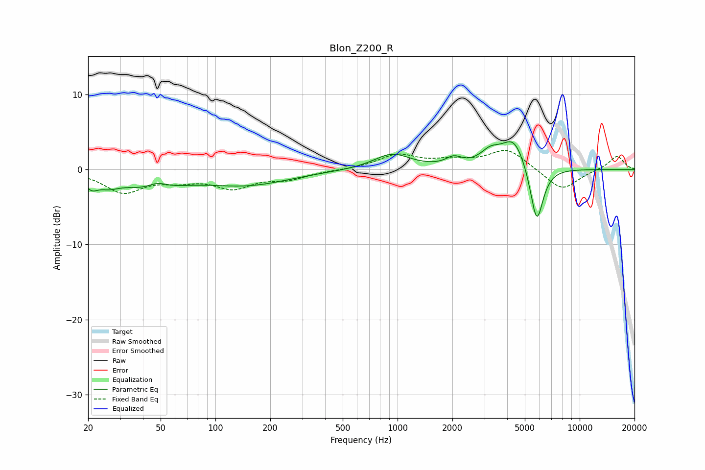

# Blon_Z200_R
See [usage instructions](https://github.com/jaakkopasanen/AutoEq#usage) for more options and info.

### Parametric EQs
Apply preamp of -3.8 dB when using parametric equalizer.

|   # | Type    |   Fc (Hz) |    Q |   Gain (dB) |
|-----|---------|-----------|------|-------------|
|   1 | Peaking |        21 | 3.86 |        -1.5 |
|   2 | Peaking |        26 | 2.6  |        -1   |
|   3 | Peaking |        43 | 0.82 |        -2.2 |
|   4 | Peaking |        48 | 2.66 |         0.9 |
|   5 | Peaking |       151 | 0.61 |        -1.9 |
|   6 | Peaking |       933 | 1.41 |         2.1 |
|   7 | Peaking |      2035 | 3.28 |         1.1 |
|   8 | Peaking |      3228 | 2.53 |         1.7 |
|   9 | Peaking |      4359 | 2.04 |         4.2 |
|  10 | Peaking |      5809 | 3.79 |        -8   |

### Fixed Band EQs
When using fixed band (also called graphic) equalizer, apply preamp of **-2.6 dB** (if available) and set gains manually with these parameters.

|   # | Type    |   Fc (Hz) |    Q |   Gain (dB) |
|-----|---------|-----------|------|-------------|
|   1 | Peaking |        31 | 1.41 |        -2.9 |
|   2 | Peaking |        62 | 1.41 |        -1.1 |
|   3 | Peaking |       125 | 1.41 |        -2.2 |
|   4 | Peaking |       250 | 1.41 |        -1.1 |
|   5 | Peaking |       500 | 1.41 |        -0   |
|   6 | Peaking |      1000 | 1.41 |         1.9 |
|   7 | Peaking |      2000 | 1.41 |         0.9 |
|   8 | Peaking |      4000 | 1.41 |         2.7 |
|   9 | Peaking |      8000 | 1.41 |        -2.9 |
|  10 | Peaking |     16000 | 1.41 |         1.9 |

### Graphs

