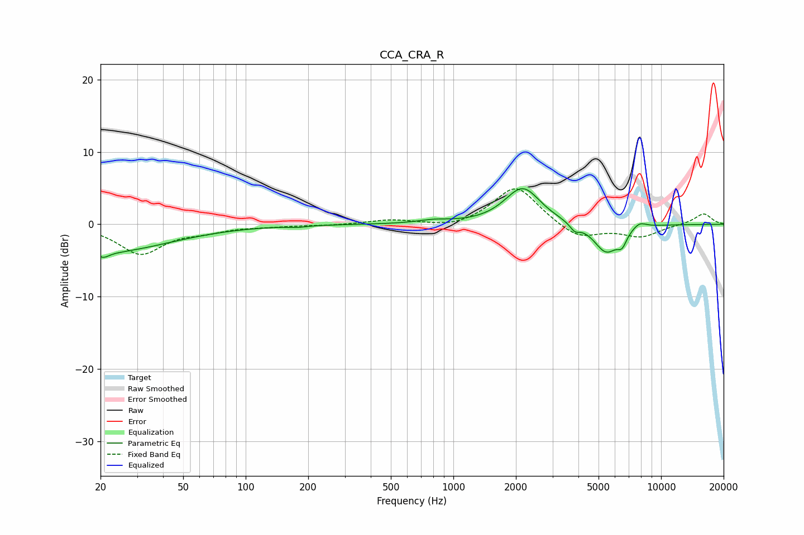

# CCA_CRA_R
See [usage instructions](https://github.com/jaakkopasanen/AutoEq#usage) for more options and info.

### Parametric EQs
Apply preamp of -5.0 dB when using parametric equalizer.

|   # | Type    |   Fc (Hz) |    Q |   Gain (dB) |
|-----|---------|-----------|------|-------------|
|   1 | Peaking |        20 | 0.44 |        -3.9 |
|   2 | Peaking |        21 | 5.46 |        -0.7 |
|   3 | Peaking |       177 | 3.27 |        -0.2 |
|   4 | Peaking |       802 | 1.88 |         0.4 |
|   5 | Peaking |      1856 | 2.28 |         0.2 |
|   6 | Peaking |      2168 | 1.68 |         4.9 |
|   7 | Peaking |      3840 | 6    |        -1   |
|   8 | Peaking |      5439 | 2.3  |        -4   |
|   9 | Peaking |      6487 | 5.97 |        -1.6 |
|  10 | Peaking |      7856 | 3.91 |         0.9 |

### Fixed Band EQs
When using fixed band (also called graphic) equalizer, apply preamp of **-5.0 dB** (if available) and set gains manually with these parameters.

|   # | Type    |   Fc (Hz) |    Q |   Gain (dB) |
|-----|---------|-----------|------|-------------|
|   1 | Peaking |        31 | 1.41 |        -4   |
|   2 | Peaking |        62 | 1.41 |        -0.8 |
|   3 | Peaking |       125 | 1.41 |        -0.2 |
|   4 | Peaking |       250 | 1.41 |        -0.1 |
|   5 | Peaking |       500 | 1.41 |         0.6 |
|   6 | Peaking |      1000 | 1.41 |        -0.6 |
|   7 | Peaking |      2000 | 1.41 |         5.4 |
|   8 | Peaking |      4000 | 1.41 |        -2.1 |
|   9 | Peaking |      8000 | 1.41 |        -1.7 |
|  10 | Peaking |     16000 | 1.41 |         1.5 |

### Graphs

