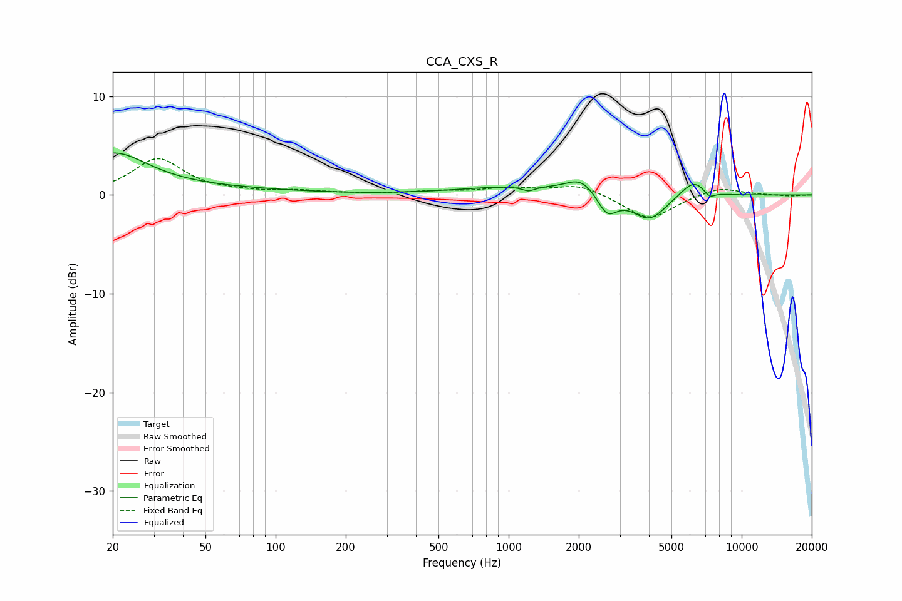

# CCA_CXS_R
See [usage instructions](https://github.com/jaakkopasanen/AutoEq#usage) for more options and info.

### Parametric EQs
Apply preamp of -4.3 dB when using parametric equalizer.

|   # | Type    |   Fc (Hz) |    Q |   Gain (dB) |
|-----|---------|-----------|------|-------------|
|   1 | Peaking |        20 | 0.94 |         4   |
|   2 | Peaking |        53 | 0.41 |         0.5 |
|   3 | Peaking |      1060 | 0.6  |         0.8 |
|   4 | Peaking |      1216 | 5.26 |        -0.5 |
|   5 | Peaking |      2051 | 2.23 |         1.5 |
|   6 | Peaking |      2645 | 3.34 |        -2.2 |
|   7 | Peaking |      4015 | 1.94 |        -2.6 |
|   8 | Peaking |      6120 | 2.57 |         1.5 |
|   9 | Peaking |      6550 | 5.12 |         0.2 |
|  10 | Peaking |      7282 | 5.97 |        -0.6 |

### Fixed Band EQs
When using fixed band (also called graphic) equalizer, apply preamp of **-3.8 dB** (if available) and set gains manually with these parameters.

|   # | Type    |   Fc (Hz) |    Q |   Gain (dB) |
|-----|---------|-----------|------|-------------|
|   1 | Peaking |        31 | 1.41 |         3.6 |
|   2 | Peaking |        62 | 1.41 |         0.2 |
|   3 | Peaking |       125 | 1.41 |         0.4 |
|   4 | Peaking |       250 | 1.41 |         0.1 |
|   5 | Peaking |       500 | 1.41 |         0.3 |
|   6 | Peaking |      1000 | 1.41 |         0.6 |
|   7 | Peaking |      2000 | 1.41 |         1.1 |
|   8 | Peaking |      4000 | 1.41 |        -2.6 |
|   9 | Peaking |      8000 | 1.41 |         0.9 |
|  10 | Peaking |     16000 | 1.41 |        -0.1 |

### Graphs

